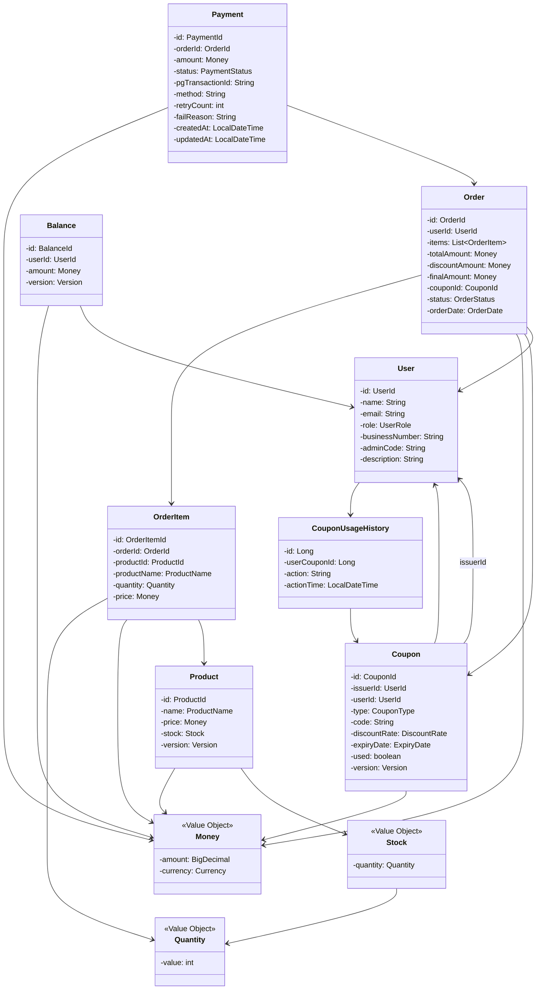

## 1. Domain & VO Layer
> 도메인 모델(Aggregate)과 값 객체(Value Object) 간의 연결 구조를 중심으로 표현합니다.

```mermaid
classDiagram
%% 사용자
    class User {
        -id: UserId
        -name: String
        -email: String
        -role: UserRole
        -businessNumber: String
        -adminCode: String
        -description: String
    }

%% 주문
    class Order {
        -id: OrderId
        -userId: UserId
        -items: List~OrderItem~
        -totalAmount: Money
        -discountAmount: Money
        -finalAmount: Money
        -couponId: CouponId
        -status: OrderStatus
        -orderDate: OrderDate
    }
    Order --> OrderItem
    Order --> Money

    class OrderItem {
        -id: OrderItemId
        -orderId: OrderId
        -productId: ProductId
        -productName: ProductName
        -quantity: Quantity
        -price: Money
    }
    OrderItem --> Quantity
    OrderItem --> Money

%% 결제
    class Payment {
        -id: PaymentId
        -orderId: OrderId
        -amount: Money
        -status: PaymentStatus
        -pgTransactionId: String
        -method: String
        -retryCount: int
        -failReason: String
        -createdAt: LocalDateTime
        -updatedAt: LocalDateTime
    }
    Payment --> Money

%% 상품
    class Product {
        -id: ProductId
        -name: ProductName
        -price: Money
        -stock: Stock
        -version: Version
    }
    Product --> Money
    Product --> Stock
    Stock --> Quantity

%% 잔액
    class Balance {
        -id: BalanceId
        -userId: UserId
        -amount: Money
        -version: Version
    }
    Balance --> Money

%% 쿠폰
    class Coupon {
        -id: CouponId
        -issuerId: UserId
        -userId: UserId
        -type: CouponType
        -code: String
        -discountRate: DiscountRate
        -expiryDate: ExpiryDate
        -used: boolean
        -version: Version
    }
    Coupon --> Money

%% 쿠폰 이력
    class CouponUsageHistory {
        -id: Long
        -userCouponId: Long
        -action: String
        -actionTime: LocalDateTime
    }
    CouponUsageHistory --> Coupon

%% 값 객체들
    class Money {
<<Value Object>>
-amount: BigDecimal
-currency: Currency
}

class Quantity {
<<Value Object>>
-value: int
    }

class Stock {
<<Value Object>>
-quantity: Quantity
    }

%% 관계 정의
Order --> Coupon
Order --> User
Payment --> Order
Balance --> User
Coupon --> User
Coupon --> User : issuerId
OrderItem --> Product
User --> CouponUsageHistory
```
