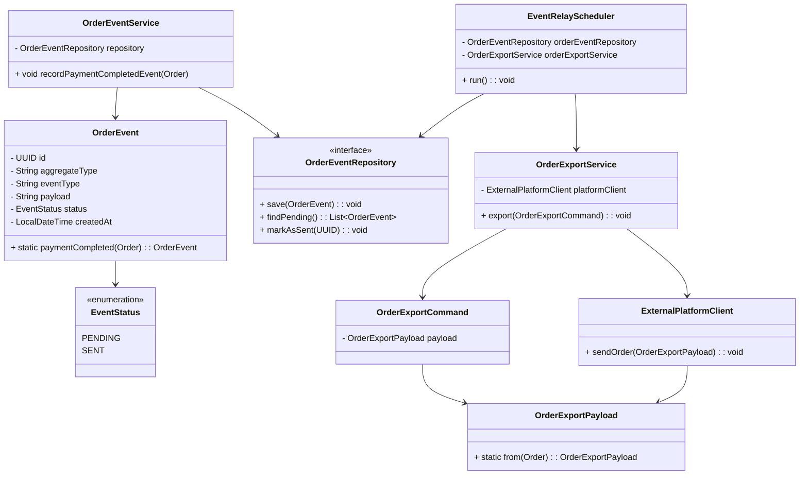

```mermaid
classDiagram
    class OrderEvent {
        - UUID id
        - String aggregateType
        - String eventType
        - String payload
        - EventStatus status
        - LocalDateTime createdAt
        + static paymentCompleted(Order): OrderEvent
    }

    class EventStatus {
        <<enumeration>>
        PENDING
        SENT
    }

    class OrderEventService {
        - OrderEventRepository repository
        + void recordPaymentCompletedEvent(Order)
    }

    class OrderEventRepository {
        <<interface>>
        + save(OrderEvent): void
        + findPending(): List~OrderEvent~
        + markAsSent(UUID): void
    }

    class EventRelayScheduler {
        - OrderEventRepository orderEventRepository
        - OrderExportService orderExportService
        + run(): void
    }

    class OrderExportService {
        - ExternalPlatformClient platformClient
        + export(OrderExportCommand): void
    }

    class OrderExportCommand {
        - OrderExportPayload payload
    }

    class OrderExportPayload {
        + static from(Order): OrderExportPayload
    }

    class ExternalPlatformClient {
        + sendOrder(OrderExportPayload): void
    }

    %% 관계 정의
    OrderEventService --> OrderEventRepository
    OrderEventService --> OrderEvent
    OrderEvent --> EventStatus
    EventRelayScheduler --> OrderEventRepository
    EventRelayScheduler --> OrderExportService
    OrderExportService --> ExternalPlatformClient
    OrderExportService --> OrderExportCommand
    OrderExportCommand --> OrderExportPayload
    ExternalPlatformClient --> OrderExportPayload
```
