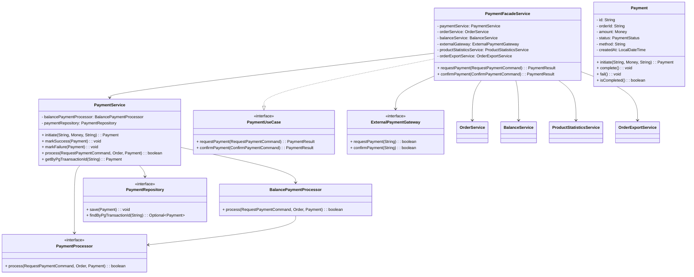

```mermaid
classDiagram

class PaymentFacadeService {
  - paymentService: PaymentService
  - orderService: OrderService
  - balanceService: BalanceService
  - externalGateway: ExternalPaymentGateway
  - productStatisticsService: ProductStatisticsService
  - orderExportService: OrderExportService
  + requestPayment(RequestPaymentCommand): PaymentResult
  + confirmPayment(ConfirmPaymentCommand): PaymentResult
}

class PaymentService {
  - balancePaymentProcessor: BalancePaymentProcessor
  - paymentRepository: PaymentRepository
  + initiate(String, Money, String): Payment
  + markSuccess(Payment): void
  + markFailure(Payment): void
  + process(RequestPaymentCommand, Order, Payment): boolean
  + getByPgTraansactionId(String): Payment
}

class Payment {
  - id: String
  - orderId: String
  - amount: Money
  - status: PaymentStatus
  - method: String
  - createdAt: LocalDateTime
  + initiate(String, Money, String): Payment
  + complete(): void
  + fail(): void
  + isCompleted(): boolean
}

class PaymentUseCase {
  <<interface>>
  + requestPayment(RequestPaymentCommand): PaymentResult
  + confirmPayment(ConfirmPaymentCommand): PaymentResult
}

class PaymentProcessor {
  <<interface>>
  + process(RequestPaymentCommand, Order, Payment): boolean
}

class BalancePaymentProcessor {
  + process(RequestPaymentCommand, Order, Payment): boolean
}

class PaymentRepository {
  <<interface>>
  + save(Payment): void
  + findByPgTransactionId(String): Optional~Payment~
}

class ExternalPaymentGateway {
  <<interface>>
  + requestPayment(String): boolean
  + confirmPayment(String): boolean
}

class OrderService
class BalanceService
class ProductStatisticsService
class OrderExportService

PaymentFacadeService --> PaymentService
PaymentFacadeService --> OrderService
PaymentFacadeService --> BalanceService
PaymentFacadeService --> ProductStatisticsService
PaymentFacadeService --> OrderExportService
PaymentFacadeService --> ExternalPaymentGateway

PaymentService --> PaymentRepository
PaymentService --> BalancePaymentProcessor
PaymentService --> PaymentProcessor

BalancePaymentProcessor --> PaymentProcessor

PaymentFacadeService ..|> PaymentUseCase
a
```