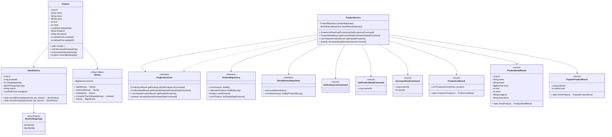

```mermaid
classDiagram
    class Product {
        - Long id
        - String name
        - String brand
        - Money price
        - int size
        - int stock
        - LocalDate releaseDate
        - String imageUrl
        - String description
        - LocalDateTime createdAt
        - LocalDateTime updatedAt
        + static create(...)
        + void decreaseStock(quantity)
        + void increaseStock(quantity)
        + boolean isAvailable(quantity)
    }

    class StockHistory {
        - Long id
        - Long productId
        - int changedQuantity
        - StockChangeType type
        - String reason
        - LocalDateTime changedAt
        + static recordDecrease(productId, qty, reason): StockHistory
        + static recordIncrease(productId, qty, reason): StockHistory
    }

    class StockChangeType {
        <<enumeration>>
        INCREASE
        DECREASE
    }

    class Money {
<<Value Object>>
- BigDecimal amount
+ add(Money): Money
+ subtract(Money): Money
+ multiply(int): Money
+ isGreaterThanOrEqual(Money): boolean
+ value(): BigDecimal
}

class ProductService {
- ProductRepository productRepository
- StockHistoryRepository stockHistoryRepository
+ ProductListResult getProductList(GetProductListCommand)
+ ProductDetailResult getProductDetail(GetProductDetailCommand)
+ List~PopularProductResult~ getPopularProducts()
+ boolean decreaseStock(DecreaseStockCommand)
}

class ProductUseCase {
<<interface>>
+ ProductListResult getProductList(GetProductListCommand)
+ ProductDetailResult getProductDetail(GetProductDetailCommand)
+ List~PopularProductResult~ getPopularProducts()
+ boolean decreaseStock(DecreaseStockCommand)
}

class ProductRepository {
<<interface>>
+ List~Product~ findAll()
+ Optional~Product~ findById(Long)
+ Product save(Product)
+ List~Product~ findTopSellingProducts()
}

class StockHistoryRepository {
<<interface>>
+ void save(StockHistory)
+ List~StockHistory~ findByProductId(Long)
}

class GetProductListCommand {
<<record>>
}

class GetProductDetailCommand {
<<record>>
- Long productId
}

class DecreaseStockCommand {
<<record>>
- Long productId
- int quantity
}

class ProductListResult {
<<record>>
- List~ProductSummaryDto~ products
+ static from(List~Product~): ProductListResult
}

class ProductDetailResult {
<<record>>
- Long id
- String name
- String brand
- BigDecimal price
- int size
- int stock
- String imageUrl
- String description
+ static from(Product): ProductDetailResult
}

class PopularProductResult {
<<record>>
- Long productId
- int salesCount
+ static from(Product): PopularProductResult
}

%% 관계 설정
ProductService --> ProductRepository
ProductService --> StockHistoryRepository
ProductService --> ProductUseCase
ProductUseCase <|.. ProductService
Product --> Money
Product --> StockHistory
StockHistory --> StockChangeType
ProductService --> GetProductListCommand
ProductService --> GetProductDetailCommand
ProductService --> DecreaseStockCommand
ProductService --> ProductListResult
ProductService --> ProductDetailResult
ProductService --> PopularProductResult

```