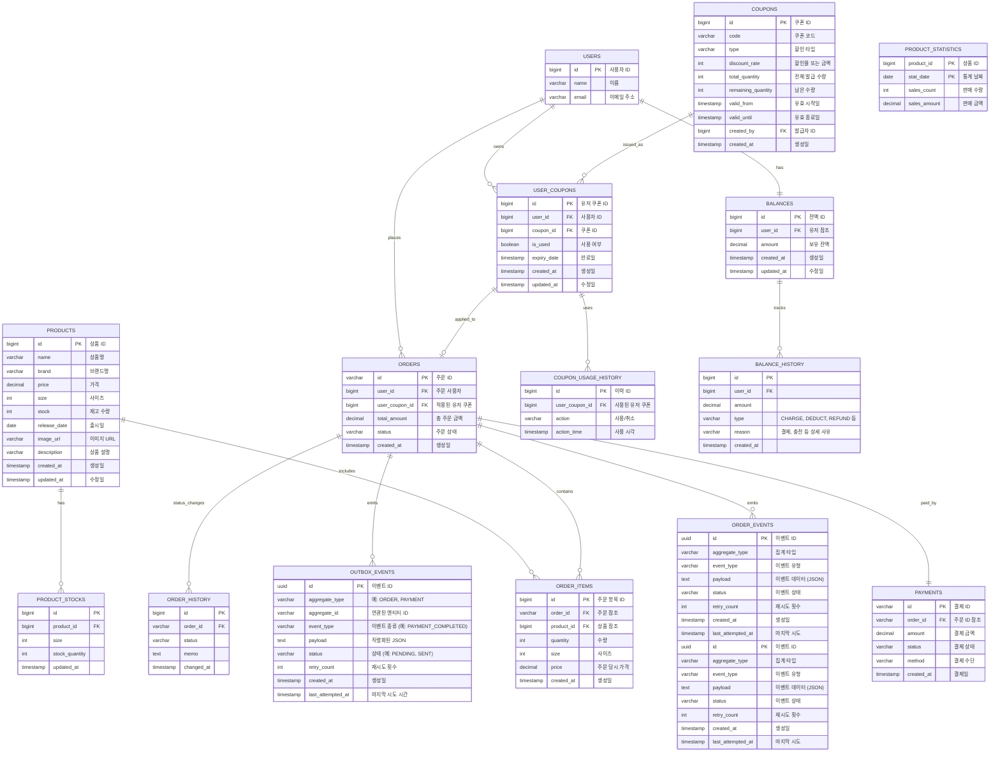

# E-R 다이어그램

```mermaid
erDiagram
    USERS ||--o{ ORDERS : places
    USERS ||--|| BALANCES : has
    USERS ||--o{ USER_COUPONS : owns
    PRODUCTS ||--o{ ORDER_ITEMS : includes
    ORDERS ||--o{ ORDER_ITEMS : contains
    ORDERS ||--|| PAYMENTS : paid_by
    ORDERS ||--o{ ORDER_EVENTS : emits
    ORDERS ||--o{ OUTBOX_EVENTS : emits
    COUPONS ||--o{ USER_COUPONS : issued_as
    USER_COUPONS ||--o| ORDERS : applied_to
    USER_COUPONS ||--o{ COUPON_USAGE_HISTORY : uses
    PRODUCTS ||--o{ PRODUCT_STOCKS : has
    BALANCES ||--o{ BALANCE_HISTORY : tracks
    ORDERS ||--o{ ORDER_HISTORY : status_changes

    USERS {
        bigint id PK "사용자 ID"
        varchar name "이름"
        varchar email "이메일 주소"
    }

    BALANCES {
        bigint id PK "잔액 ID"
        bigint user_id FK "유저 참조"
        decimal amount "보유 잔액"
        timestamp created_at "생성일"
        timestamp updated_at "수정일"
    }
    BALANCE_HISTORY {
        bigint id PK
        bigint user_id FK
        decimal amount
        varchar type "CHARGE, DEDUCT, REFUND 등"
        varchar reason "결제, 충전 등 상세 사유"
        timestamp created_at
    }
    PRODUCTS {
        bigint id PK "상품 ID"
        varchar name "상품명"
        varchar brand "브랜드명"
        decimal price "가격"
        int size "사이즈"
        int stock "재고 수량"
        date release_date "출시일"
        varchar image_url "이미지 URL"
        varchar description "상품 설명"
        timestamp created_at "생성일"
        timestamp updated_at "수정일"
    }
    PRODUCT_STOCKS {
        bigint id PK
        bigint product_id FK
        int size
        int stock_quantity
        timestamp updated_at
    }
    ORDERS {
        varchar id PK "주문 ID"
        bigint user_id FK "주문 사용자"
        bigint user_coupon_id FK "적용된 유저 쿠폰"
        decimal total_amount "총 주문 금액"
        varchar status "주문 상태"
        timestamp created_at "생성일"
    }
    ORDER_HISTORY {
        bigint id PK
        varchar order_id FK
        varchar status
        text memo
        timestamp changed_at
    }
    ORDER_EVENTS {
        uuid id PK "이벤트 ID"
        varchar aggregate_type "집계 타입"
        varchar event_type "이벤트 유형"
        text payload "이벤트 데이터 (JSON)"
        varchar status "이벤트 상태"
        int retry_count "재시도 횟수"
        timestamp created_at "생성일"
        timestamp last_attempted_at "마지막 시도"
    }
    ORDER_ITEMS {
        bigint id PK "주문 항목 ID"
        varchar order_id FK "주문 참조"
        bigint product_id FK "상품 참조"
        int quantity "수량"
        int size "사이즈"
        decimal price "주문 당시 가격"
        timestamp created_at "생성일"
    }

    PAYMENTS {
        varchar id PK "결제 ID"
        varchar order_id FK "주문 ID 참조"
        decimal amount "결제 금액"
        varchar status "결제 상태"
        varchar method "결제 수단"
        timestamp created_at "결제일"
    }

    ORDER_EVENTS {
        uuid id PK "이벤트 ID"
        varchar aggregate_type "집계 타입"
        varchar event_type "이벤트 유형"
        text payload "이벤트 데이터 (JSON)"
        varchar status "이벤트 상태"
        int retry_count "재시도 횟수"
        timestamp created_at "생성일"
        timestamp last_attempted_at "마지막 시도"
    }

    PRODUCT_STATISTICS {
        bigint product_id PK "상품 ID"
        date stat_date PK "통계 날짜"
        int sales_count "판매 수량"
        decimal sales_amount "판매 금액"
    }

    COUPONS {
        bigint id PK "쿠폰 ID"
        varchar code "쿠폰 코드"
        varchar type "할인 타입"
        int discount_rate "할인율 또는 금액"
        int total_quantity "전체 발급 수량"
        int remaining_quantity "남은 수량"
        timestamp valid_from "유효 시작일"
        timestamp valid_until "유효 종료일"
        bigint created_by FK "발급자 ID"
        timestamp created_at "생성일"
    }

    USER_COUPONS {
        bigint id PK "유저 쿠폰 ID"
        bigint user_id FK "사용자 ID"
        bigint coupon_id FK "쿠폰 ID"
        boolean is_used "사용 여부"
        timestamp expiry_date "만료일"
%%        bigint version "버전 (동시성 제어)"
        timestamp created_at "생성일"
        timestamp updated_at "수정일"
    }

    COUPON_USAGE_HISTORY {
        bigint id PK "이력 ID"
        bigint user_coupon_id FK "사용된 유저 쿠폰"
        varchar action "사용/취소"
        timestamp action_time "사용 시각"
    }

    OUTBOX_EVENTS {
        uuid id PK "이벤트 ID"
        varchar aggregate_type "예: ORDER, PAYMENT"
        varchar aggregate_id "연관된 엔티티 ID"
        varchar event_type "이벤트 종류 (예: PAYMENT_COMPLETED)"
        text payload "직렬화된 JSON"
        varchar status "상태 (예: PENDING, SENT)"
        int retry_count "재시도 횟수"
        timestamp created_at "생성일"
        timestamp last_attempted_at "마지막 시도 시간"
    }
```
