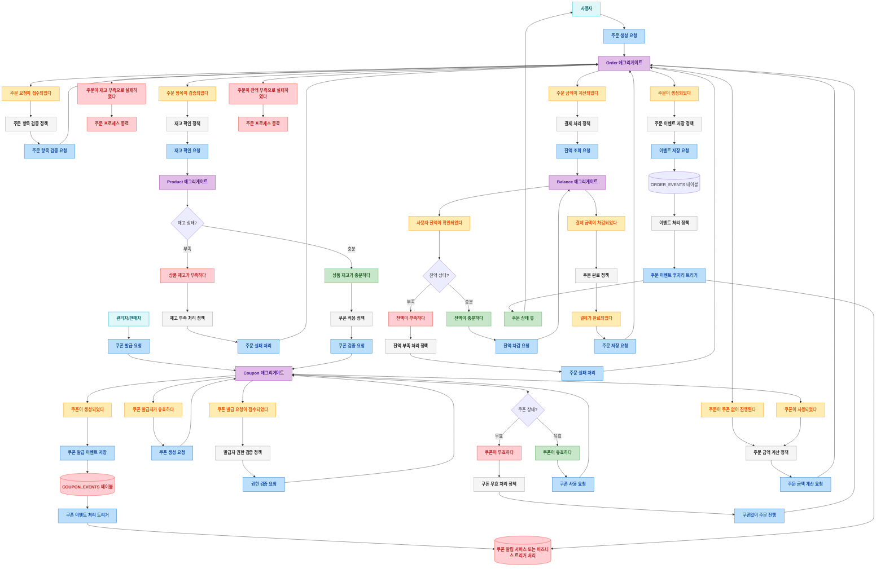

## Step 3 - 프로세스 모델링 다이어그램 (쿠폰 발급 포함)

```mermaid
flowchart TD
%% 스타일 정의
    classDef actor fill:#E0F7FA,stroke:#00BCD4,color:#006064,font-weight:bold;
    classDef command fill:#BBDEFB,stroke:#1976D2,color:#0D47A1,font-weight:bold;
    classDef event fill:#FFECB3,stroke:#FF9800,color:#E65100,font-weight:bold;
    classDef policy fill:#F5F5F5,stroke:#9E9E9E,color:#212121,font-weight:bold;
    classDef aggregate fill:#E1BEE7,stroke:#9C27B0,color:#4A148C,font-weight:bold;
    classDef external fill:#FFCDD2,stroke:#F44336,color:#B71C1C,font-weight:bold;
    classDef view fill:#C8E6C9,stroke:#4CAF50,color:#1B5E20,font-weight:bold;
    classDef success fill:#C8E6C9,stroke:#4CAF50,color:#1B5E20,font-weight:bold;
    classDef failure fill:#FFCDD2,stroke:#F44336,color:#B71C1C,font-weight:bold;

%% 액터 및 애그리게이트
    A1[사용자]:::actor
    A2[관리자/판매자]:::actor
    AG1[Order 애그리게이트]:::aggregate
    AG2[Product 애그리게이트]:::aggregate
    AG3[Coupon 애그리게이트]:::aggregate
    AG4[Balance 애그리게이트]:::aggregate
    OUTBOX[(COUPON_EVENTS 테이블)]:::external
    EXT_LOGIC[(쿠폰 알림 서비스 또는 비즈니스 트리거 처리)]:::external

%% --- 쿠폰 발급 흐름 수정 ---
    A2 --> C0[쿠폰 발급 요청]:::command
    C0 --> AG3
    AG3 --> E0_1[쿠폰 발급 요청이 접수되었다]:::event
    E0_1 --> P0[발급자 권한 검증 정책]:::policy
    P0 --> C0_2[권한 검증 요청]:::command
    C0_2 --> AG3
    AG3 --> E0_2[쿠폰 발급자가 유효하다]:::event
    E0_2 --> C0_3[쿠폰 생성 요청]:::command
    C0_3 --> AG3
    AG3 --> E0_3[쿠폰이 생성되었다]:::event
    E0_3 --> C0_4[쿠폰 발급 이벤트 저장]:::command
    C0_4 --> OUTBOX
    OUTBOX --> C0_5[쿠폰 이벤트 처리 트리거]:::command
    C0_5 --> EXT_LOGIC

%% 주문 요청 및 검증
    A1 --> C1[주문 생성 요청]:::command
    C1 --> AG1
    AG1 --> E1[주문 요청이 접수되었다]:::event
    E1 --> P1[주문 항목 검증 정책]:::policy
    P1 --> C2[주문 항목 검증 요청]:::command
    C2 --> AG1
    AG1 --> E2[주문 항목이 검증되었다]:::event

%% 재고 확인
    E2 --> P2[재고 확인 정책]:::policy
    P2 --> C3[재고 확인 요청]:::command
    C3 --> AG2

%% 재고 충분/부족 분기
    AG2 --> E3_1{재고 상태?}
    E3_1 -->|충분| E3[상품 재고가 충분하다]:::success
    E3_1 -->|부족| E3X[상품 재고가 부족하다]:::failure

%% 재고 부족 예외 처리
    E3X --> P_EX1[재고 부족 처리 정책]:::policy
    P_EX1 --> C_EX1[주문 실패 처리]:::command
    C_EX1 --> AG1
    AG1 --> E_EX1[주문이 재고 부족으로 실패하였다]:::failure
    E_EX1 --> END_EX1[주문 프로세스 종료]:::failure

%% 재고 충분 시 계속 진행
    E3 --> P3[쿠폰 적용 정책]:::policy

%% 쿠폰 검증 및 사용
    P3 --> C4[쿠폰 검증 요청]:::command
    C4 --> AG3

%% 쿠폰 유효/무효 분기
    AG3 --> E4_1{쿠폰 상태?}
    E4_1 -->|유효| E4[쿠폰이 유효하다]:::success
    E4_1 -->|무효| E4X[쿠폰이 무효하다]:::failure

%% 쿠폰 무효 예외 처리
    E4X --> P_EX2[쿠폰 무효 처리 정책]:::policy
    P_EX2 --> C_EX2[쿠폰없이 주문 진행]:::command
    C_EX2 --> AG1
    AG1 --> E_EX2[주문이 쿠폰 없이 진행된다]:::event
    E_EX2 --> P4[주문 금액 계산 정책]:::policy

%% 쿠폰 유효 시 처리
    E4 --> C5[쿠폰 사용 요청]:::command
    C5 --> AG3
    AG3 --> E5[쿠폰이 사용되었다]:::event
    E5 --> P4

%% 주문 금액 계산
    P4 --> C6[주문 금액 계산 요청]:::command
    C6 --> AG1
    AG1 --> E6[주문 금액이 계산되었다]:::event

%% 잔액 확인
    E6 --> P5[결제 처리 정책]:::policy
    P5 --> C7[잔액 조회 요청]:::command
    C7 --> AG4
    AG4 --> E7[사용자 잔액이 확인되었다]:::event

%% 잔액 충분/부족 분기
    E7 --> E8_1{잔액 상태?}
    E8_1 -->|충분| E8[잔액이 충분하다]:::success
    E8_1 -->|부족| E8X[잔액이 부족하다]:::failure

%% 잔액 부족 예외 처리
    E8X --> P_EX3[잔액 부족 처리 정책]:::policy
    P_EX3 --> C_EX3[주문 실패 처리]:::command
    C_EX3 --> AG1
    AG1 --> E_EX3[주문이 잔액 부족으로 실패하였다]:::failure
    E_EX3 --> END_EX3[주문 프로세스 종료]:::failure

%% 잔액 충분 시 결제 진행
    E8 --> C8[잔액 차감 요청]:::command
    C8 --> AG4
    AG4 --> E9[결제 금액이 차감되었다]:::event

%% 결제 완료 및 주문 생성
    E9 --> P6[주문 완료 정책]:::policy
    P6 --> E10[결제가 완료되었다]:::event
    E10 --> C9[주문 저장 요청]:::command
    C9 --> AG1
    AG1 --> E11[주문이 생성되었다]:::event

%% 트랜잭셔널 아웃박스 패턴
    E11 --> P7[주문 이벤트 저장 정책]:::policy
    P7 --> C10[이벤트 저장 요청]:::command
    C10 --> DB[(ORDER_EVENTS 테이블)]
    DB --> P8[이벤트 처리 정책]:::policy
    P8 --> C11[주문 이벤트 후처리 트리거]:::command
    C11 --> EXT_LOGIC

%% 주문 프로세스 뷰
    C11 --> V1[주문 상태 뷰]:::view
    V1 --> A1
```