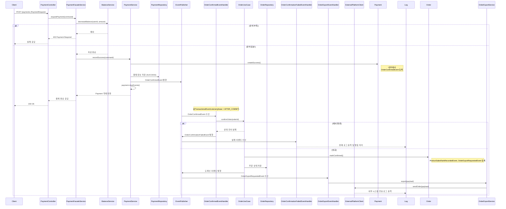

## ✅ V2: 주문 상태 확정 실패 및 외부 시스템 전송 처리까지 포함한 결제 흐름

### 📌 핵심 변경 사항 요약

> 핵심 추가 사항:
>
> 주문과 결제를 분리된 도메인으로 설계하고, **결제 성공 시 주문이 확정(CONFIRMED)**된다.
>
> 결제 처리 성공 시, Payment 엔티티는 OrderConfirmedEvent를 등록하고 ApplicationEventPublisher를 통해 이벤트를 발행한다.
> 
> 이벤트 리스너는 OrderUseCase.confirmOrder()를 호출하여 주문 상태를 CONFIRMED로 변경한다.
> 
> 이 과정에서 예외가 발생하면 OrderConfirmationFailedEvent가 발행되어 실패 원인을 추적하고 후속 조치를 위한 알림 또는 보상 트리거로 활용된다.
>
> 주문이 CONFIRMED 상태로 전이되면, Order 도메인은 내부에서 ProductSalesRankRecordedEvent와 OrderExportRequestedEvent 두 가지 도메인 이벤트를 추가로 등록한다.
>
> 이 중 OrderExportRequestedEvent는 외부 데이터 플랫폼과의 연동을 위한 이벤트로, 트랜잭션 커밋 이후 OrderExportEventHandler에서 수신되어 외부 전송 로직을 수행한다.
>
> 이 후속 처리 흐름은 외부 시스템 장애가 주문 흐름에 영향을 주지 않도록 비동기 이벤트 기반으로 안전하게 분리되어 있으며, 향후 Kafka 또는 DLQ 기반의 재처리 구조로 확장 가능하다.


---

### ✅ 도메인 이벤트 흐름

```
[결제 성공]
 → Payment.createSuccess(...) 내부에서 OrderConfirmedEvent 등록
 → @TransactionalEventListener(phase = AFTER_COMMIT) OrderConfirmedEventHandler.handle(...)
     → 주문 확인 로직 호출(OrderUseCase.confirmOrder)
         → CONFIRMED 상태로 전이 성공 시:
             - ProductSalesRankRecordedEvent 등록
             - OrderExportRequestedEvent 등록
             - 두 이벤트가 커밋 이후 발행됨
         → 실패 시:
             - OrderConfirmationFailedEvent 발행
             - 복구 및 알림 핸들링 가능
 → OrderExportRequestedEvent는 OrderExportEventHandler에서 수신
     → OrderExportService → ExternalPlatformClient (Fake) 통해 외부 전송 수행
```

---

### ✅ 시퀀스 다이어그램 (V2 전체 흐름)



---

### ✅ 실제 적용된 클래스 요약

| 클래스 | 역할 |
| --- | --- |
| `Payment#createSuccess()` | `OrderConfirmedEvent` 등록 |
| `PaymentService#recordSuccess()` | 결제 저장 후 이벤트 발행 |
| `OrderConfirmedEventHandler` | 주문 상태 확정 시도 |
| `OrderUseCase#confirmOrder()` | CONFIRMED 전이 + 후속 이벤트 등록 |
| `OrderExportRequestedEvent` | 외부 전송 요청 도메인 이벤트 |
| `OrderExportEventHandler` | 외부 전송 이벤트 리스너 |
| `OrderExportService` | 외부 플랫폼 전송 서비스 |
| `ExternalPlatformClient` | 실제 외부 연동 구현체 (Fake) |