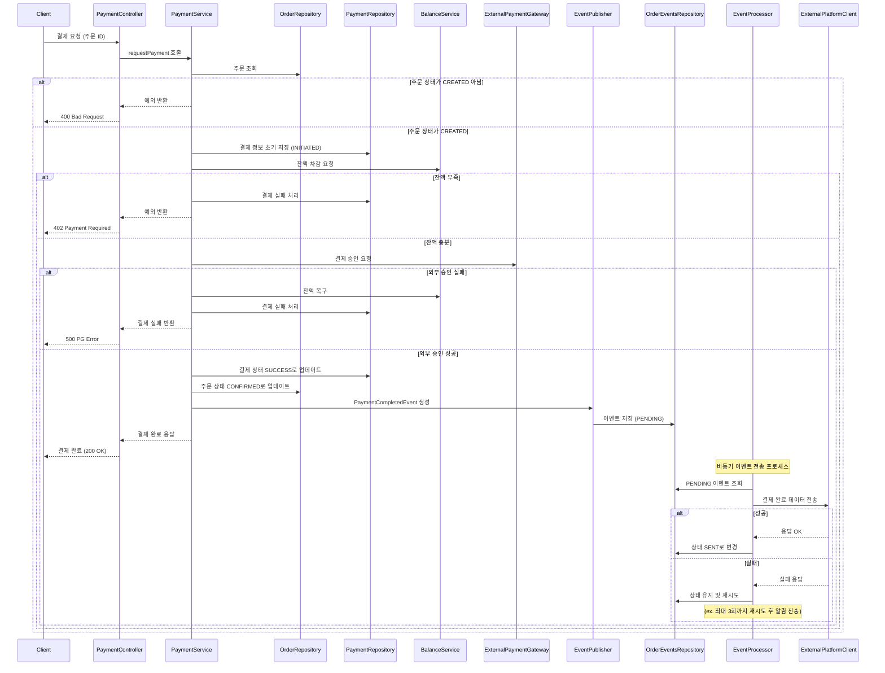

## 결제 요청

>주문과 결제를 분리된 도메인으로 설계하되, **결제 성공 시 주문이 확정(CONFIRMED)**되는 구조이다.
>외부 PG 연동 실패나 잔액 부족 상황에 대비해 명확한 분기 처리와 복구 로직이 존재하며,
>결제 완료 이벤트는 ORDER_EVENTS 테이블에 저장 후 비동기 전송된다.
>이를 통해 트랜잭션 내 데이터 일관성과 외부 전송 실패 복원력을 동시에 확보한다.
>
> ### **설계 배경**
>
> 스니커즈 이커머스 서비스에서는 주문과 결제를 분리된 도메인으로 설계했으며, 결제가 완료된 시점을 기준으로 주문이 확정된다.  
> 이때 외부 데이터 플랫폼에 주문 정보를 전송해야 하는데, 실패에 대비해 **트랜잭셔널 아웃박스 패턴**을 도입했다.  
> 결제 성공 시 OrderConfirmed + PaymentCompleted 상태를 함께 저장하고, 이벤트는 ORDER_EVENTS 테이블에 PENDING으로 저장 후 **비동기 전송 흐름**으로 처리된다.
> 
> ### 요약 
> 주문과 결제를 분리된 도메인으로 설계하되, **결제 성공 시 주문이 확정(CONFIRMED)**되는 구조이다.
외부 PG 연동 실패나 잔액 부족 상황에 대비해 명확한 분기 처리와 복구 로직이 존재하며,
결제 완료 이벤트는 ORDER_EVENTS 테이블에 저장 후 비동기 전송된다.
이를 통해 트랜잭션 내 데이터 일관성과 외부 전송 실패 복원력을 동시에 확보한다.

