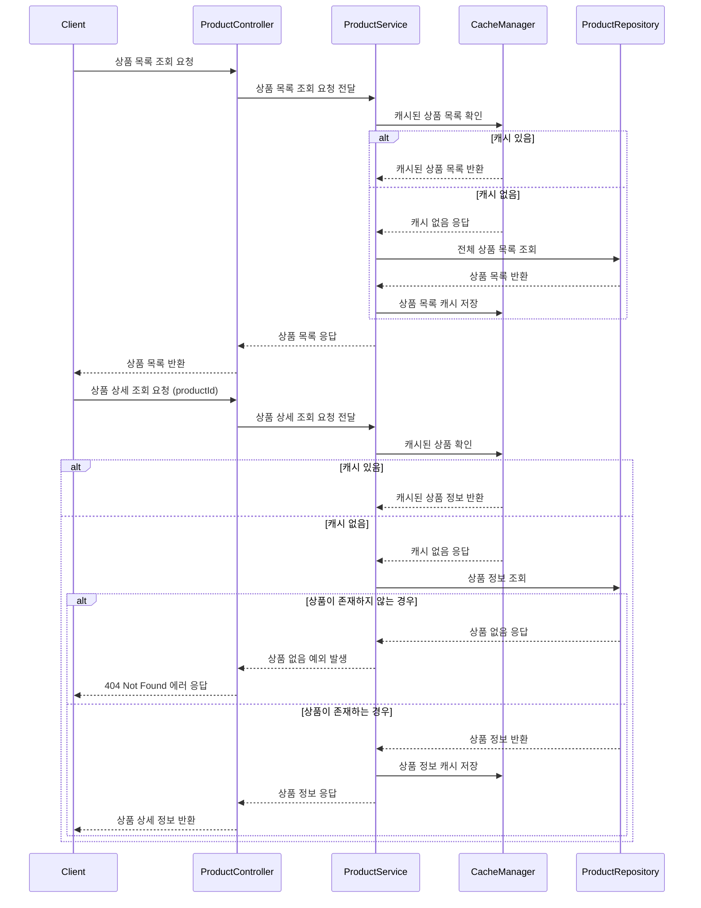

>## 상품 조회 시나리오
> 
>전체 상품 목록 및 개별 상품 상세 조회는 캐싱 전략 기반으로 구현된다.
Redis 등 외부 캐시 시스템을 사용해 조회 성능을 개선하고, 캐시 미스 시에만 DB 접근하도록 설계되어 있다.
캐시 적중 여부에 따라 분기 처리되며, 상품이 존재하지 않을 경우 404 응답을 반환한다.
>
>### **설계 배경**
> 
>트래픽이 집중되는 스니커즈 이커머스의 특성상, 상품 목록이나 상세 조회 요청이 자주 발생한다.
이에 따라 **조회 성능을 높이고 DB 부하를 줄이기 위해 캐시 우선 전략(Cache-Aside Pattern)**을 도입하였다.
캐시 저장 시점은 조회 후이며, 상품 정보는 자주 바뀌지 않으므로 TTL(Time-To-Live)을 설정해 운영 효율을 확보한다.
> 
> ### 요약
> 전체 상품 목록 또는 단일 상품 상세 정보 조회 시, 먼저 캐시를 확인하고 없을 경우 DB에서 조회한다.
캐시 미스가 발생하면 조회된 데이터를 캐시에 저장하며,
단일 상품 요청 시 상품이 존재하지 않을 경우 404 예외를 반환한다.
성능 향상을 위해 Redis 또는 인메모리 캐시가 사용될 수 있다.

