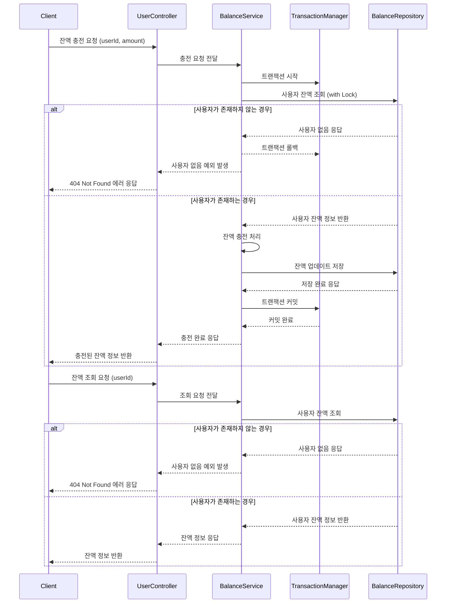

> ## 잔액 충전 및 조회 프로세스
> 
> 사용자 잔액은 주문/결제에 선결 조건이 되는 핵심 자산 정보로, 트랜잭션 일관성이 매우 중요하다.
충전 요청은 Lock 기반의 선점 처리로 Race Condition을 방지하고, 잔액 조회는 단순 조회로 처리한다.
충전 시 with Lock 조회 후 상태 기반 업데이트 및 트랜잭션 커밋을 통해 정확한 상태 전이를 보장한다.
>
>### 설계 배경
> 
>충전은 선불 결제 수단으로 사용되며, 결제 이전의 상태 기반 리소스이다.
따라서 다른 트랜잭션과 충돌하지 않도록 낙관적 락 or 비관적 락 전략 중 비관적 락(Pessimistic Lock)을 적용하여 충전 중 동시성 문제를 예방했다.
단순 조회는 락 없이 처리하며, 추후 통합 테스트나 Concurrency 테스트로 Race Condition 을 방어할 수 있도록 구조를 나눴다.
> 
> ### 요약
> 
> 사용자의 잔액 충전 요청 시, 해당 유저의 잔액을 조회하여 충전 금액을 반영하고 저장한다.
모든 충전은 트랜잭션으로 처리되며, 존재하지 않는 사용자에 대해서는 예외가 발생한다.
잔액 조회 시에는 단순 조회 로직으로 처리되며, 존재하지 않는 유저에 대해서도 예외를 반환한다.

