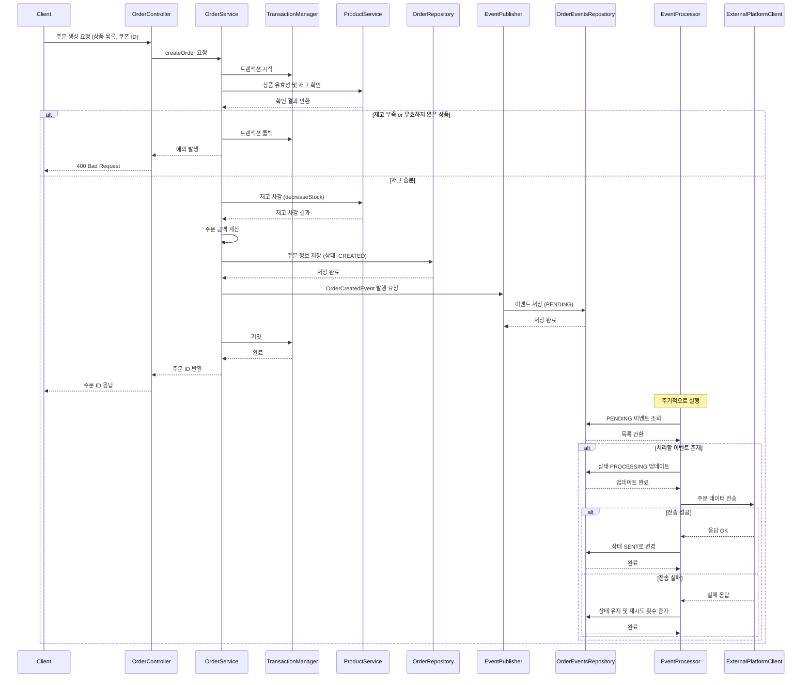

>## 주문 생성 시나리오
>
>스니커즈 이커머스 서비스에서는 결제 전 단계에서 주문을 먼저 생성하고, 상품 유효성 및 재고 확인 후 재고를 차감한다.
이때 주문 정보는 저장되지만 상태는 **CREATED**로 유지된다.
주문 생성 이벤트는 트랜잭셔널 아웃박스 패턴을 통해 ORDER_EVENTS 테이블에 저장되며, 외부 데이터 플랫폼 전송은 비동기로 처리된다.
>
>### **설계 배경**
> 
> 주문과 결제를 분리한 설계 구조에서는 주문 생성 자체가 결제 성공을 전제로 하지 않기 때문에 독립적 트랜잭션으로 동작한다.
> 따라서 주문 생성 이벤트는 먼저 발생하고, 이후 결제가 완료되면 CONFIRMED 상태로 갱신된다.
외부 전송 실패에 대한 복원력을 확보하기 위해 아웃박스 패턴을 적용했고, 주문 저장과 이벤트 저장은 같은 트랜잭션에서 커밋되도록 처리한다.
> 
> ### 요약
> 
> 주문 요청 시 상품 유효성 및 재고를 확인하고, 문제가 없을 경우 재고를 차감한 후 주문을 생성한다.
이 과정에서 주문 생성 이벤트는 ORDER_EVENTS 테이블에 저장되며,
별도의 비동기 프로세스를 통해 외부 데이터 플랫폼으로 전송된다.
재고 부족, 유효하지 않은 상품 등은 트랜잭션 롤백으로 처리된다.

