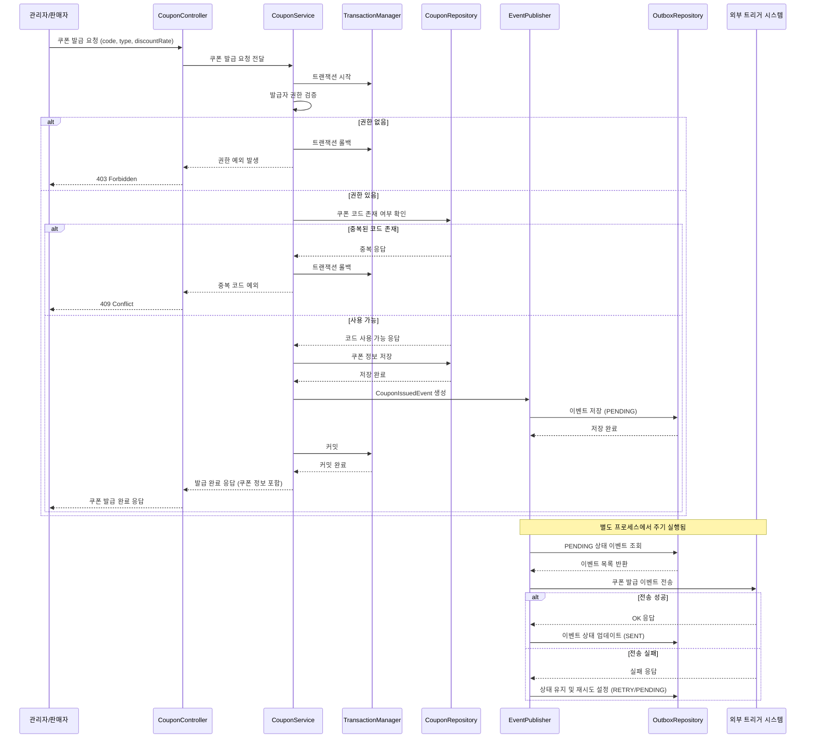

> ## 쿠폰 발급 및 조회 시나리오
>
>### 설계 배경
> 
>쿠폰 발급 요청 시 권한과 중복 여부를 검증한 뒤, 발급 이벤트를 Outbox에 저장한다.
발급 후 외부 트리거 시스템으로 비동기 이벤트를 전송하며, 실패 시 재시도 처리를 위한 상태 업데이트가 포함된다.
>
> ### 요약 설명
> 
>판매자가 발급 요청한 쿠폰은 권한과 중복 여부를 검증한 뒤 저장된다.
발급 이벤트는 Outbox에 PENDING 상태로 저장되며, 별도의 프로세스가 외부 트리거 시스템으로 전송한다.
실패한 이벤트는 RETRY 상태로 업데이트되어 재처리 로직을 통해 안정성을 확보한다.

