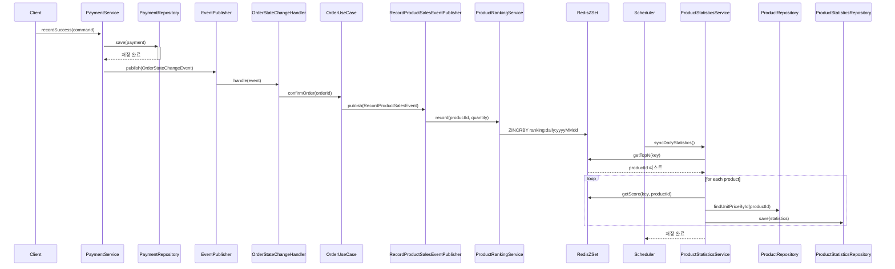

> # 판매 통계 저장 프로세스
>
>
> 판매 통계는 결제 완료 시점에 도메인 이벤트를 통해 Redis에 기록되며, 이 기록은 익일 새벽 스케줄러에 의해 MySQL 통계 테이블로 동기화된다.
>
> Redis Sorted Set은 일간 기준 키(`ranking:daily:yyyyMMdd`)로 데이터를 누적하며, TTL을 통해 불필요한 메모리 사용을 방지한다.
>
> 동기화된 통계는 이후 인기 상품 조회 시 기준 데이터로 사용된다.
>
> ### 설계 배경
>
> 실시간 상품 판매 데이터는 인기 상품 기능뿐만 아니라 마케팅, 추천 알고리즘 등 다양한 기능의 기반이 되므로, 신뢰성과 확장성을 동시에 확보해야 한다.
> 
> 이커머스 도메인에서 트래픽이 집중되는 결제 완료 시점을 기준으로 랭킹 메트릭을 Redis에 비동기 저장하고,
>
> 이후 RDB로 정제된 통계를 저장함으로써 시스템 부담을 줄이고 복원 가능성을 확보한다.
>
> ### 요약
>
> 결제 완료 → 주문 상태 변경 → 판매 이벤트 발행 → Redis 기록 → 익일 스케줄러 실행 → MySQL 테이블 반영이라는 흐름으로 통계 데이터를 누적한다.
>
> 이를 통해 실시간성과 유지비용을 동시에 만족하는 데이터 파이프라인을 구성하며, 인기 상품 조회 등 후속 기능의 기반이 된다.
>
