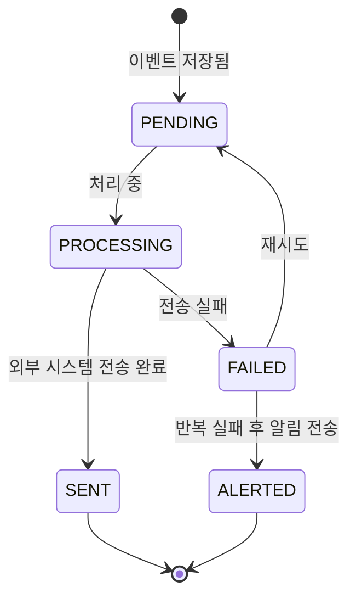

> ### 설명
> 모든 Outbox 이벤트는 PENDING → PROCESSING → SENT 순으로 상태가 흐르며,
실패 시 재시도 또는 알림이 필요할 경우 별도 상태로 이동된다.

```mermaid
stateDiagram-v2
    [*] --> PENDING: 이벤트 저장됨
    PENDING --> PROCESSING: 처리 중
    PROCESSING --> SENT: 외부 시스템 전송 완료
    PROCESSING --> FAILED: 전송 실패
    FAILED --> PENDING: 재시도
    FAILED --> ALERTED: 반복 실패 후 알림 전송
    SENT --> [*]
    ALERTED --> [*]

```