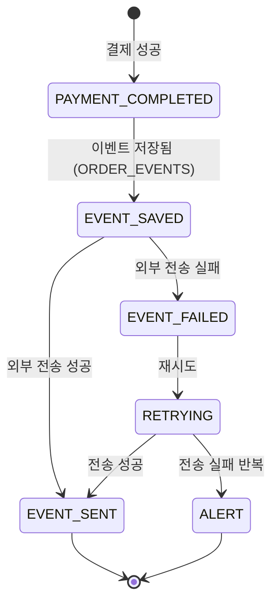

> ### 설명
> 이 상태 다이어그램은 **결제 성공 후 이벤트 발행 → 외부 전송 → 실패 복구** 흐름에만 집중하였다.
> 전체 결제 흐름은 `sequence-diagram/결제 요청.md`에 정의되어 있으며, 이 문서는 이벤트 전송 처리만 별도로 추적하기 위한 보조 자료이다.

```mermaid
stateDiagram-v2
    [*] --> PAYMENT_COMPLETED: 결제 성공
    PAYMENT_COMPLETED --> EVENT_SAVED: 이벤트 저장됨 (ORDER_EVENTS)
    EVENT_SAVED --> EVENT_SENT: 외부 전송 성공
    EVENT_SAVED --> EVENT_FAILED: 외부 전송 실패
    EVENT_FAILED --> RETRYING: 재시도
    RETRYING --> EVENT_SENT: 전송 성공
    RETRYING --> ALERT: 전송 실패 반복
    ALERT --> [*]
    EVENT_SENT --> [*]

```