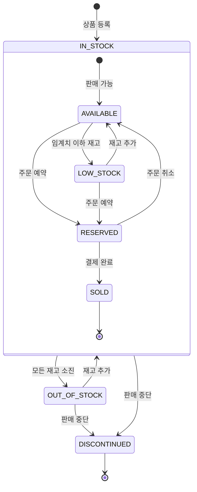

>### 설명
>상품의 재고 상태 흐름을 중심으로 설계.
재고 수량, 임계치, 예약/취소 등에 따른 상태 전이가 명확하게 표현된다.

```mermaid
stateDiagram-v2
    [*] --> IN_STOCK: 상품 등록
    
    state IN_STOCK {
        [*] --> AVAILABLE: 판매 가능
        
        AVAILABLE --> RESERVED: 주문 예약
        AVAILABLE --> LOW_STOCK: 임계치 이하 재고
        
        RESERVED --> AVAILABLE: 주문 취소
        RESERVED --> SOLD: 결제 완료
        
        LOW_STOCK --> RESERVED: 주문 예약
        LOW_STOCK --> AVAILABLE: 재고 추가
        
        SOLD --> [*]
    }
    
    IN_STOCK --> OUT_OF_STOCK: 모든 재고 소진
    IN_STOCK --> DISCONTINUED: 판매 중단
    
    OUT_OF_STOCK --> IN_STOCK: 재고 추가
    OUT_OF_STOCK --> DISCONTINUED: 판매 중단
    
    DISCONTINUED --> [*]

```