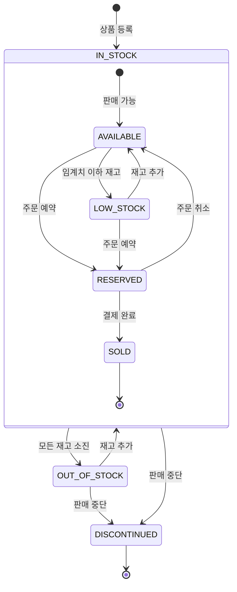

> ### 설명
> 상품은 등록(IN_STOCK)된 이후 다양한 재고 상태를 가진다.
주문 예약, 재고 소진, 판매 중단 등의 이벤트에 따라 상태가 전이되며,
특히 AVAILABLE → RESERVED → SOLD 흐름은 주문/결제와 밀접하게 연결된다.
임계 재고를 고려한 LOW_STOCK 처리로 UX 향상과 운영 안정성을 확보한다.

```mermaid
stateDiagram-v2
    [*] --> IN_STOCK: 상품 등록
    
    state IN_STOCK {
        [*] --> AVAILABLE: 판매 가능
        
        AVAILABLE --> RESERVED: 주문 예약
        AVAILABLE --> LOW_STOCK: 임계치 이하 재고
        
        RESERVED --> AVAILABLE: 주문 취소
        RESERVED --> SOLD: 결제 완료
        
        LOW_STOCK --> RESERVED: 주문 예약
        LOW_STOCK --> AVAILABLE: 재고 추가
        
        SOLD --> [*]
    }
    
    IN_STOCK --> OUT_OF_STOCK: 모든 재고 소진
    IN_STOCK --> DISCONTINUED: 판매 중단
    
    OUT_OF_STOCK --> IN_STOCK: 재고 추가
    OUT_OF_STOCK --> DISCONTINUED: 판매 중단
    
    DISCONTINUED --> [*]
```