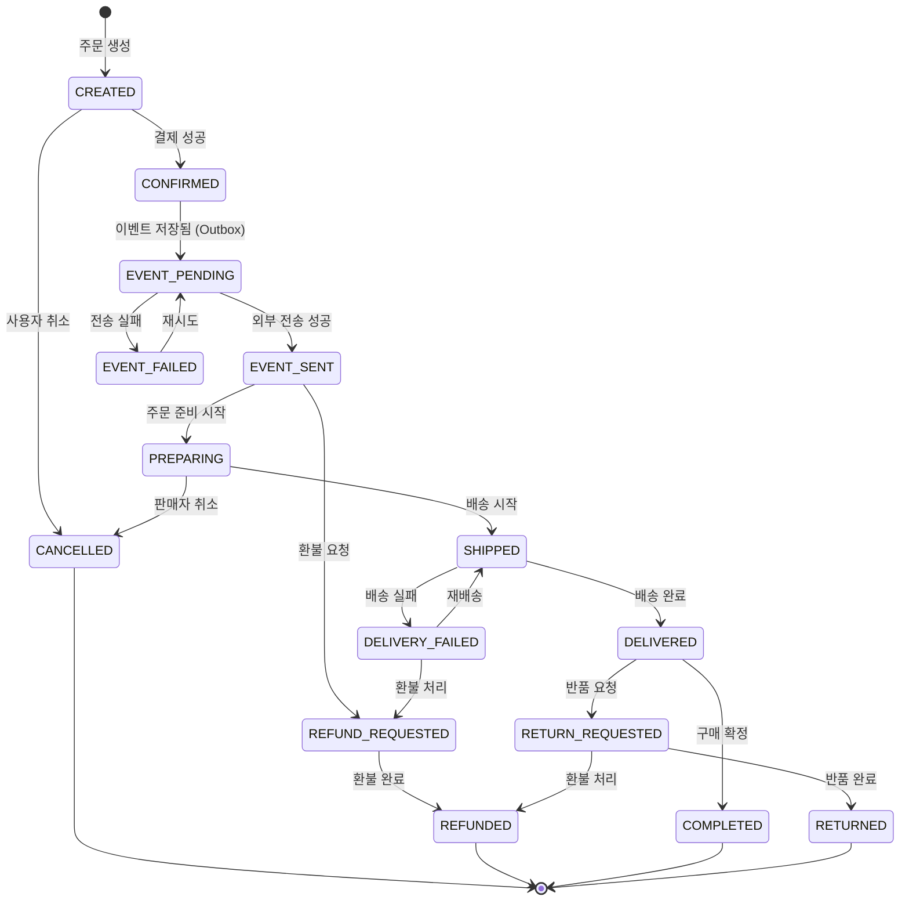

> ### 설명
> 주문 → 결제 → 이벤트 발행 → 준비/배송/완료 → 환불/반품까지의 전 과정을 아우른다.
Outbox 기반 이벤트 처리 상태를 중간 단계로 명시하여, 외부 시스템 연동 흐름을 포함했다.

```mermaid
stateDiagram-v2
    [*] --> CREATED: 주문 생성

    CREATED --> CONFIRMED: 결제 성공
    CREATED --> CANCELLED: 사용자 취소

    CONFIRMED --> EVENT_PENDING: 이벤트 저장됨 (Outbox)
    EVENT_PENDING --> EVENT_SENT: 외부 전송 성공
    EVENT_PENDING --> EVENT_FAILED: 전송 실패
    EVENT_FAILED --> EVENT_PENDING: 재시도

    EVENT_SENT --> PREPARING: 주문 준비 시작
    EVENT_SENT --> REFUND_REQUESTED: 환불 요청

    PREPARING --> SHIPPED: 배송 시작
    PREPARING --> CANCELLED: 판매자 취소

    SHIPPED --> DELIVERED: 배송 완료
    SHIPPED --> DELIVERY_FAILED: 배송 실패

    DELIVERY_FAILED --> SHIPPED: 재배송
    DELIVERY_FAILED --> REFUND_REQUESTED: 환불 처리

    REFUND_REQUESTED --> REFUNDED: 환불 완료

    DELIVERED --> COMPLETED: 구매 확정
    DELIVERED --> RETURN_REQUESTED: 반품 요청

    RETURN_REQUESTED --> RETURNED: 반품 완료
    RETURN_REQUESTED --> REFUNDED: 환불 처리

    CANCELLED --> [*]
    REFUNDED --> [*]
    COMPLETED --> [*]
    RETURNED --> [*]

```