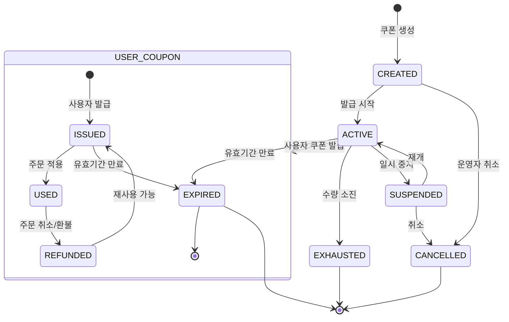

> ### 설명
>쿠폰 발급부터 사용, 만료, 소진, 일시 정지까지 운영 관점의 흐름과
사용자별 쿠폰 발급/사용/환불 후 재사용 흐름까지 표현하였다.

```mermaid
stateDiagram-v2
    [*] --> CREATED: 쿠폰 생성

    CREATED --> ACTIVE: 발급 시작
    CREATED --> CANCELLED: 운영자 취소

    ACTIVE --> EXHAUSTED: 수량 소진
    ACTIVE --> EXPIRED: 유효기간 만료
    ACTIVE --> SUSPENDED: 일시 중지

    SUSPENDED --> ACTIVE: 재개
    SUSPENDED --> CANCELLED: 취소

    state "USER_COUPON" as USER {
[*] --> ISSUED: 사용자 발급

ISSUED --> USED: 주문 적용
ISSUED --> EXPIRED: 유효기간 만료

USED --> REFUNDED: 주문 취소/환불

EXPIRED --> [*]
REFUNDED --> ISSUED: 재사용 가능
}

ACTIVE --> USER: 사용자 쿠폰 발급

EXHAUSTED --> [*]
EXPIRED --> [*]
CANCELLED --> [*]

```