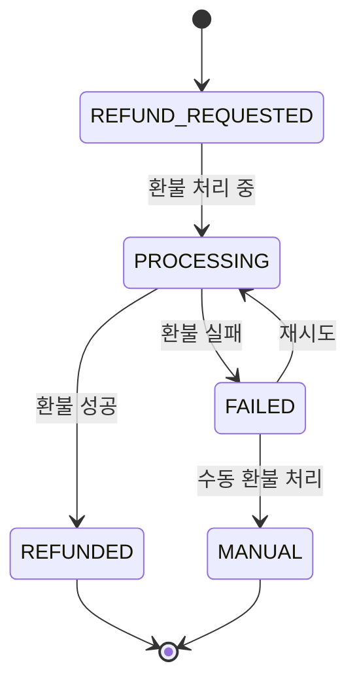

> ### 설명
> 환불 요청 → 처리 → 결과 (성공/실패)까지의 단순한 흐름을 표현.
자동 환불 실패 시, 수동 처리로 넘어가는 분기도 명확하게 표시된다.

```mermaid
stateDiagram-v2
    [*] --> REFUND_REQUESTED

    REFUND_REQUESTED --> PROCESSING: 환불 처리 중
    PROCESSING --> REFUNDED: 환불 성공
    PROCESSING --> FAILED: 환불 실패
    FAILED --> PROCESSING: 재시도
    FAILED --> MANUAL: 수동 환불 처리

    REFUNDED --> [*]
    MANUAL --> [*]

```