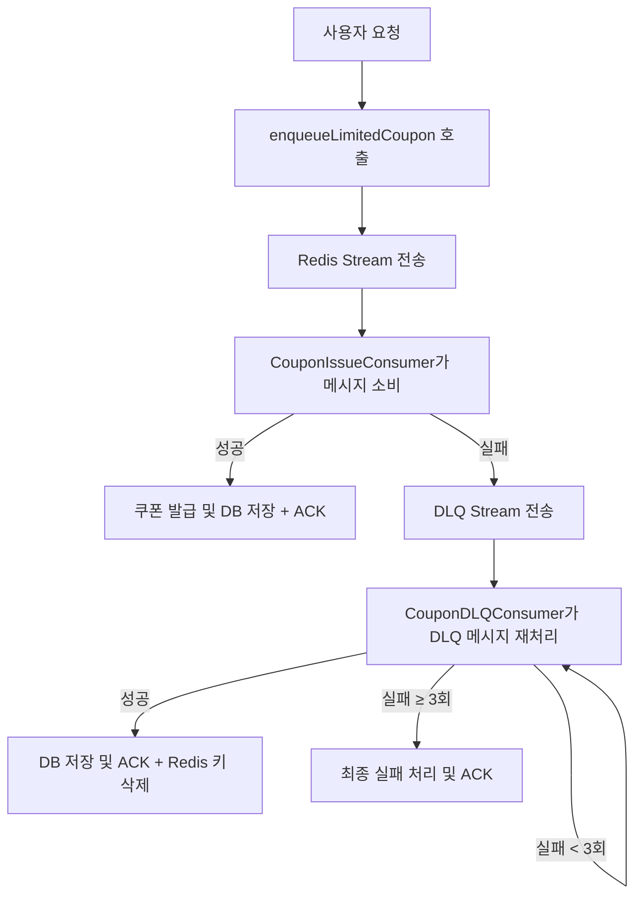
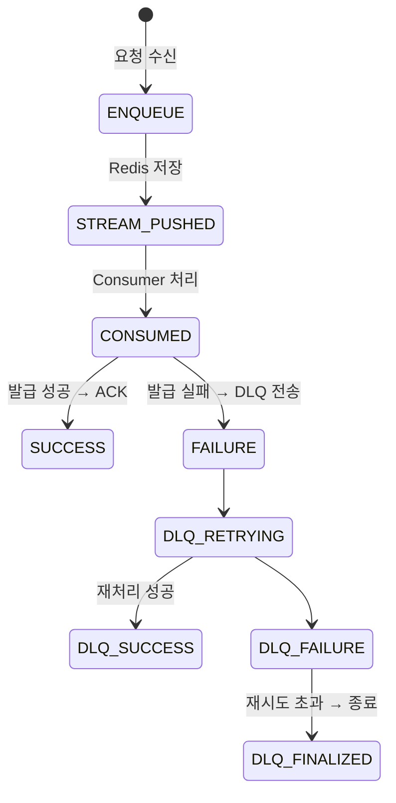

## 1. 🚩 배경 및 문제 정의

기존 쿠폰 발급 로직은 트래픽 급증 시 Race Condition, RDB 병목, 실패 재처리 불가 등 여러 문제를 갖고 있었다.

이를 해결하기 위해 Redis Stream 기반 비동기 메시징 시스템을 설계하여 다음을 달성하고자 했다:

- DB 부하 분산 및 처리 병렬화
- 실패 요청 재처리를 위한 DLQ 구조 도입
- 안정적인 선착순 쿠폰 발급 및 확장 가능 구조 확보

---

## 2. 🧱 시스템 설계

### ✅ 전체 아키텍처 구성



### 🧩 상태 흐름 다이어그램



---

### 🗝️ Redis Key 전략

| 항목 | Key 패턴 | 예시 |
| --- | --- | --- |
| 발급 스트림 | `coupon:stream:{code}` | `coupon:stream:WELCOME10` |
| DLQ 스트림 | `coupon:stream:dlq:{code}` | `coupon:stream:dlq:WELCOME10` |
| 재시도 카운터 | `dlq:retry:{recordId}` | `dlq:retry:1689348823-0` |

---

## 3. ⚙️ 주요 구현 내용

### ✅ Publisher: 발급 요청 처리

- `enqueueLimitedCoupon()` → `CouponIssueStreamPublisher`에서 Stream 전송
- TTL 없이 영구 저장하여 추적성 확보

```java
redisTemplate.opsForStream().add(streamKey, Map.of(
  "userId", ..., "couponCode", ..., "requestId", ...
));
```

---

### ✅ Consumer: 발급 처리

- `XREADGROUP` 방식으로 소비
- Consumer Group 존재 확인 → `BUSYGROUP` 예외 핸들링
- 성공 시 ACK, 실패 시 DLQ 전송

---

### ✅ DLQ: 실패 재처리

- 최대 재시도 3회
- 실패 시 `retryKey` 카운트 증가
- 성공 시 Redis 키 삭제 및 ACK

```java
if (retryCount >= MAX_RETRY) {
    redisTemplate.opsForStream().acknowledge(dlqKey, GROUP_NAME, record.getId());
}
```

---

## 4. 🧪 테스트 및 검증

### 🔸 단위 테스트

| 클래스 | 내용 |
| --- | --- |
| `CouponIssueConsumerTest` | Stream 생성, 메시지 소비, 예외 처리 |
| `CouponDLQConsumerTest` | 재시도 횟수별 분기 처리, ACK 처리 |

---

### 🔸 통합 테스트

| 클래스 | 시나리오 |
| --- | --- |
| `CouponIntegrationTest` | 발급 성공 → RDB 반영 확인 |
| 〃 | 발급 실패 → DLQ로 이동 확인 |
|  | DLQ → 재처리 → 성공 or 실패 확인 |

```java
Awaitility.await()
  .atMost(Duration.ofSeconds(5))
  .pollInterval(Duration.ofMillis(200))
  .until(() -> couponIssueRepository.hasIssued(userId, couponId));
```

---

## 5. 💬 회고 및 개선점

### ✅ 성과

- **처리 안정성 확보**: 메시지 유실 없이 재시도 가능
- **확장성 보장**: 구조 분리로 Kafka 등으로 확장 용이
- **분산 환경 대비**: Stateless한 구조로 Horizontal Scaling 가능

### ❗ 개선 여지

- DLQ 실패 원인 구분이 없음 → Stream 다중화 고려
- 재시도 로직 단순 → 지수 백오프 등 전략적 강화 필요
- DLQ 분석 도구 부재 → 로그, 모니터링 시스템 연계 필요

---

## ✅ 결론

이번 STEP 14는 Redis Stream을 활용해 **신뢰성 있는 비동기 쿠폰 발급 시스템**을 구축한 과제였다. 단순 발급 로직을 넘어서, 재처리 기반 DLQ 구조, Consumer 그룹 관리, 재시도 키 전략 등 운영 환경을 고려한 시스템 설계를 수행했다.

이 구조는 추후 주문 처리, 대기열 관리, 재고 차감 등 실시간 트랜잭션에도 유연하게 확장 가능하며, 실무 시스템에서도 활용 가능한 수준의 아키텍처라 판단된다.
