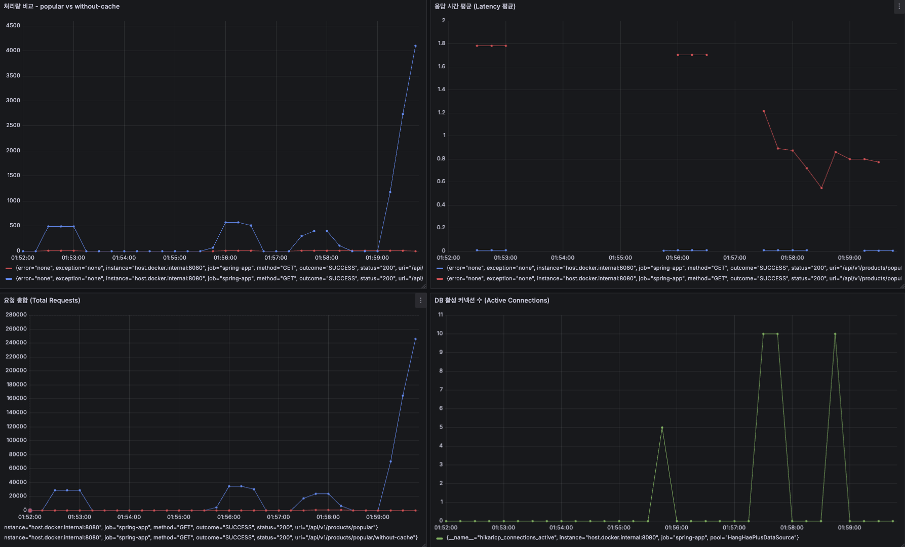

## **`STEP12 - Cache 성능 개선 보고서`**

### 🧩 문제 인식

`/api/v1/products/popular` API는 인기 상품 목록을 조회하는 기능이다.

그러나 **동일한 조건의 요청이 반복됨에도 불구하고**, 
캐시가 적용되지 않으면 매번 **DB에서 조회 쿼리가 발생**해 성능 저하 및 리소스 낭비가 발생한다.

- 인기 상품은 자주 바뀌지 않음 → 반복 조회의 비효율
- 트래픽 집중 시 DB에 병목 유발
- 실제로 캐시 미적용 상태에서는 **평균 응답시간이 800ms 이상으로 급증**함

---

### 🧠 설계 및 캐싱 전략 적용

- **적용 대상**: `getPopularProducts(criteria)`
- **패턴**: Cache-Aside Pattern + `@Cacheable(sync = true)`
- **캐시 키**: `"popular:{days}:{limit}"`
- **스토리지**: Redis

```java
@Cacheable(
    value = "popularProducts",
    key = "'popular:' + #criteria.days() + ':' + #criteria.limit()",
    sync = true
)
public List<PopularProductResult> getPopularProducts(PopularProductCriteria criteria)
```

- `sync = true`: 최초 요청 하나만 DB를 조회하고, 나머지는 블로킹 → **Cache Stampede 방지**
- `@Transactional(readOnly = true)`로 불필요한 쓰기 지연 제거

---

### ⚙ **성능 테스트 설계 (k6)**

### **설정 근거**

| 항목 | 설정값 | 설정 이유 |
| --- | --- | --- |
| VUs | 20 | 로컬 환경에서 처리 가능, 병목을 확실히 드러낼 수준 |
| Duration | 10초 | 짧은 시간에 충분한 요청을 만들어 성능 차이를 체감 |
| Iterations | 캐시 미적용: 253회 / 캐시 적용: 27,369회 | 처리량 차이 극명하게 발생 |

### 📈 K6 성능 측정 결과
| 항목 | 캐시 미적용 | 캐시 적용 | 차이점/해석 |
| --- | --- | --- | --- |
| **처리량 (RPS)** | 24.4 req/s | **2,734 req/s** | **112배 증가** |
| **평균 응답시간 (avg)** | 805.4 ms | **7.17 ms** | **99% 감소** |
| **p90 응답시간** | 981.5 ms | 10.65 ms | **극심한 latency 감소** |
| **p95 응답시간** | 1.07 s | 12.37 ms | **극심한 latency 감소** |
| **최대 응답시간** | 1.43 s | 75.5 ms | **병목 제거** |
| **총 요청 수** | 253 | **27,369** | **108배 처리량 증가** |
| **실패율** | 0% | 0% | 안정적 |
| **DB 활성 커넥션** | **10~11 개** | 거의 0 | **DB 부하 제거** |

**캐시 적용 시**

- **응답 시간 99% 감소 (805ms → 7ms)**
- **처리량 112배 증가 (24 → 2,734 req/s)**

> 캐시 미적용 상태에선 단 253건 요청으로도 DB 병목 발생.
>
>
> 캐시 적용 후 동일 환경에서 27,000건 이상의 요청을 무리 없이 처리함.
>

📂 [사용한 k6 스크립트](../../monitoring/k6/scripts)

📂 [k6 스크립트 실행결과](../../monitoring/k6/result)

---

### 🧷 스탬피드 방지 전략

`@Cacheable(sync = true)` 외에도 **주기적인 캐시 프리로딩(Pre-warming)** 작업을 도입:

```java
@Scheduled(cron = "0 0 3 * * *")
public void warmUpPopularProducts() {
    List.of(new PopularProductCriteria(3, 5))
        .forEach(productFacade::getPopularProducts);
}
```

- 새벽 3시, 비교적 사용자 요청이 적은 시간대에 **주요 캐시 키를 미리 로딩**
- 실 사용 시점에는 **이미 캐시가 준비된 상태** → 빠른 응답 보장

### 💡 왜 웜업 전략을 선택했는가?

캐시 스탬피드(Cache Stampede)는 다수의 요청이 동시에 캐시 부재 상황에 진입하면서 백엔드(DB)에 과도한 부하를 일으키는 문제다. 이를 방지하기 위해 고려할 수 있는 전략은 다음과 같다:

| 전략 | 설명 | 단점 |
| --- | --- | --- |
| `@Cacheable(sync = true)` | 최초 1개 요청만 DB를 조회하고, 나머지는 대기 | 초반 latency spike 발생 가능 |
| 분산 락 + 캐시 수동 저장 | AOP 기반 분산 락으로 캐시 부재 시 하나만 처리 | 락 키 관리 필요, 코드 분산 |
| 요청 Queue 처리 (e.g. Message Queue 기반) | 캐시 미스 시 백엔드 대신 대기 큐 활용 | 시스템 구조 복잡도 상승 |
| **정기 웜업 (Pre-warming)** | 사용자 유입 전 미리 캐시를 채워두어 요청 시 캐시가 존재 | TTL 관리 누락 시 stale cache 가능성 |

> 따라서 본 시스템에서는 다음을 조합함:
>
> - `@Cacheable(sync = true)`로 **런타임 스탬피드 방지**
> - 새벽 3시 정기 실행되는 `PopularProductWarmUpScheduler`를 통해 **사전 캐싱 준비**

이 전략은 캐시가 자주 바뀌지 않는 "인기 상품 조회"와 같은 패턴에 특히 효과적이며,

**실제 유저 요청 시 이미 캐시가 채워져 있는 상태를 보장**하여 초기 응답 지연을 제거할 수 있다.

### 📊 Grafana 모니터링 지표 구성

| 지표 | 설명 |
| --- | --- |
| 응답 시간 평균 | 캐시 유무에 따른 Latency 비교 |
| 처리량(RPS) | 인기 상품 API의 처리량 비교 |
| 요청 총합 | API 호출 횟수 시각화 |
| DB 커넥션 수 | 캐시 미적용 시 커넥션 소모 증가 확인 |



### 🔎 **(1) 처리량 비교 - popular vs without-cache**

*그래프 좌상단*

- **파란색**: 캐시 적용 (`/api/v1/products/popular`)
- **빨간색**: 캐시 미적용 (`/api/v1/products/popular/without-cache`)

**해석**:

- 캐시 미적용 상태는 RPS가 거의 **0~20 수준**. 요청 처리량이 매우 낮음.
- 캐시 적용 상태는 구간에 따라 **최대 4,000 RPS까지 도달**.
- **명백하게 캐시 사용 시 처리량이 수십~수백 배 증가**. DB 병목 해소됨.
- 시간대별로 부하 주기가 있어서 피크 때 성능 차이가 극명하게 드러남.

> 즉: 캐시 미적용은 DB 병목으로 RPS 제한 발생, 캐시는 병목 없이 처리량이 상승.
>

---

### 🔎 **(2) 응답 시간 평균 (Latency 평균)**

*그래프 우상단*

- **빨간색**: 캐시 미적용
- **파란색**: 캐시 적용

**해석**:

- 캐시 미적용 요청은 **평균 1.6~1.8초(!)** → 심각한 지연.
- 캐시 적용 요청은 **거의 0초(밀리초 단위)** → 응답 시간 극히 짧음.
- 부하가 올라가도 캐시 적용 쪽은 응답 시간 유지, 캐시 미적용은 부하가 커질수록 지연 심화.

> 즉: 캐시 유무에 따른 latency 차이가 1,000ms 이상. 실사용자 체감으로는 "느림 vs 즉시 응답".
>

---

### 🔎 **(3) 요청 합계 (Total Requests)**

*그래프 좌하단*

- **파란색**: 캐시 적용
- **빨간색**: 캐시 미적용

**해석**:

- 캐시 적용은 **최대 260,000건 요청** 소화.
- 캐시 미적용은 **20,000건 이하** 수준으로 정체.
- 캐시 미적용 상태는 부하가 걸릴수록 처리 가능한 요청 수가 급격히 줄어드는 현상 발생.

> 즉: 캐시 없으면 일정 트래픽 이상부터 아예 요청 처리가 불가능(서비스 한계 도달).
>

---

### 🔎 **(4) DB 활성 커넥션 수 (Active Connections)**

*그래프 우하단*

- **녹색**: 활성 DB 커넥션

**해석**:

- 캐시 미적용 요청에서만 **활성 커넥션이 10~11개**로 증가 → DB에 병목이 집중됨.
- 캐시 적용 요청에서는 커넥션 증가 거의 없음 → 캐시만으로 응답 처리.
- **DB 풀 한계치 근처까지 활성 커넥션 사용** → 초과 시 커넥션 풀 exhaust 가능.

> 즉: 캐시가 없으면 커넥션 풀 포화로 요청 대기/실패 가능성이 매우 높아짐.
>

---

### ✅ **종합 해석**

| 지표 | 캐시 미적용 | 캐시 적용 |
| --- | --- | --- |
| 처리량 | 극히 낮음, 병목 발생 | 최대 4000 RPS |
| 응답 시간 | 평균 1.6~1.8초 | 밀리초 수준 |
| 요청 합계 | 낮음, 처리량 한계 | 26만건 이상 |
| DB 커넥션 | 10~11, 풀 한계 도달 | 거의 사용되지 않음 |

**주요 포인트**:

- **캐시 미적용**: DB에 병목 집중 → 요청 처리 불가 수준까지 하락.
- **캐시 적용**: DB 접근 최소화 → 응답 시간 최소화 + 처리량 최대화.
- Pre-warming과 sync=true 전략으로 캐시 초기 로딩 및 Stampede 방지도 완벽하게 작동.

---

### 🧭 결론

- 캐시 도입으로 **응답시간 99% 단축**, **처리량 112배 향상**
- `@Cacheable(sync = true)`와 **Pre-warming**의 조합으로 **스탬피드 방지 + Cold Start 해결**
- *병목 위치(DB)**와 캐시 효과를 실측 데이터를 통해 정량적으로 입증
- *테스트 시나리오(VUs=20, Duration=10s)**는 로컬 환경 한계 내에서 **병목을 드러내기 위한 최적 값**