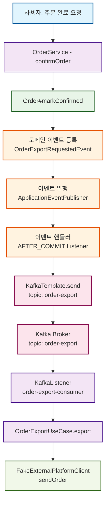
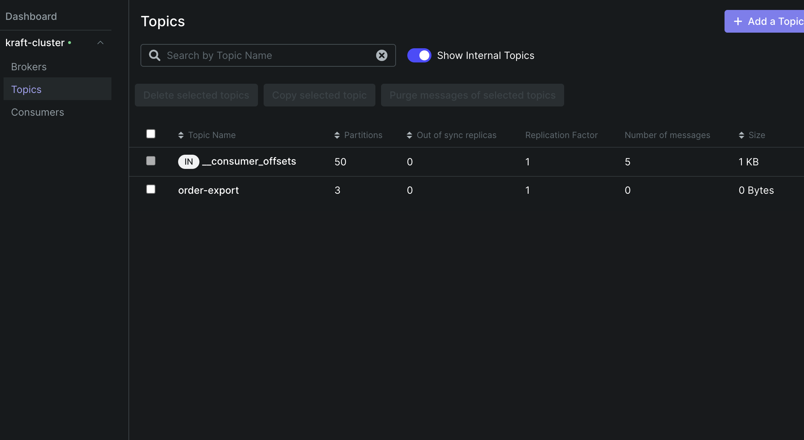
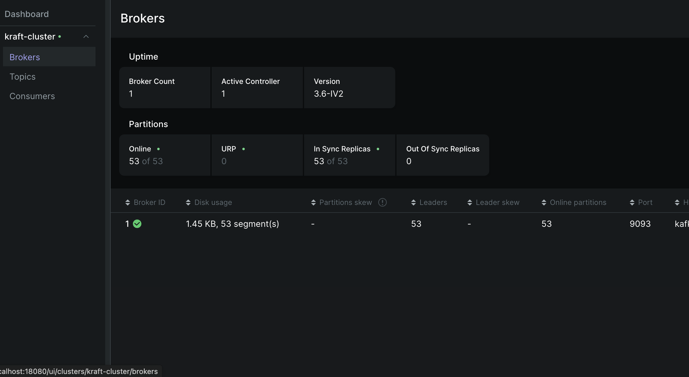
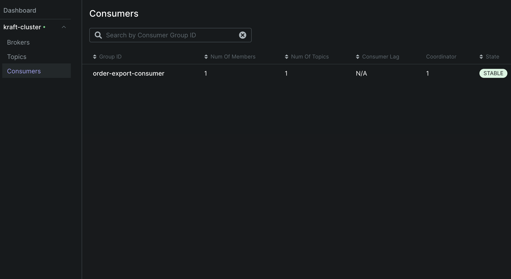

## 🧾 Kafka 개요

- **정의**: Kafka는 분산형 이벤트 저장소이자 스트림 처리 플랫폼
- **목표**: 대용량 데이터의 **고처리량 / 저지연** 처리 및 **실시간 스트리밍 파이프라인** 구축
- **특징**
    - **로그 기반 저장 구조**: append-only 구조로 순차적 디스크 접근 최적화
    - **Zero-Copy 전송**: 디스크 → 네트워크 직접 전송으로 성능 향상
    - **확장성**: 파티션 기반 수평 확장 가능
    - **복제 및 내구성**: 리더-팔로워 구조 기반 복제 기능
    - **다양한 API**: Producer, Consumer, Kafka Streams, Kafka Connect 제공
- **프로토콜**: TCP 기반의 바이너리 프로토콜

## 1. Kafka 구성 요소 설명

## **Broker**

- Kafka 서버 인스턴스로, 메시지를 저장하고 Producer 및 Consumer의 요청을 직접 처리
- 모든 Kafka 노드는 메타데이터 요청(리더 브로커 정보 등)에 응답할 수 있어 별도의 라우팅 계층이 불필요
- 각 파티션에는 **하나의 리더 브로커**가 존재하며, 해당 리더만이 Producer/Consumer 요청을 처리
- 팔로워 브로커들은 리더로부터 데이터를 복제하여 장애 복구를 위한 백업 역할 수행

### **Topic**

- 메시지의 논리적 분류 단위 (e.g. `order-export`, `user-events`)
- 내부적으로 여러 파티션으로 나뉘며, **병렬 처리 및 스케일 아웃의 기준**이 됨
- 토픽별로 보존 정책(retention policy)을 설정하여 메시지 수명 관리 가능
- 토픽은 스키마나 데이터 타입을 강제하지 않으며, 바이트 배열 형태로 저장

### **Partition**

- 메시지의 물리적 저장 단위로, **파티션 내에서만 순서가 보장됨**
- 키 기반 해시 파티셔닝 또는 라운드 로빈 전략으로 Producer가 직접 파티션을 결정
- 예: 사용자 ID 기반 해싱 → 동일 사용자의 메시지는 같은 파티션에 저장되어 순서 유지
- 파티션 수는 토픽 생성 후에도 증가 가능하지만 감소는 불가능
- 각 파티션은 독립적인 로그 파일로 저장되어 병렬 I/O 처리 가능

### **Producer**

- 메시지를 Kafka에 전송하는 클라이언트
- **파티션을 직접 선택**하거나 Kafka의 파티셔너를 통해 자동 분배 가능
- **비동기 전송 + 배치 전송**이 기본이며, 배치를 통해 높은 처리량 달성
    - 배치 크기: 기본 16KB, 최대 대기 시간: 기본 0ms (즉시 전송)
    - 설정 예: `batch.size=65536, linger.ms=10` (64KB 또는 10ms 단위 배치)
- **Idempotent Producer** 설정으로 중복 메시지 방지 가능
- `acks` 설정으로 전송 보장 수준 조절 (0: 미확인, 1: 리더만, all: 모든 복제본)

### **Consumer**

- Kafka에서 메시지를 읽는 클라이언트
- **브로커에 fetch 요청**을 보내 Pull 방식으로 데이터를 가져옴 (Push 아님)
- **오프셋 기반 위치 제어**로 필요시 과거 데이터 재처리 가능
- 메시지 처리 후 **명시적으로 오프셋을 커밋**해야 다음 메시지 읽기 가능
- `auto.offset.reset` 설정으로 오프셋이 없을 때의 시작 위치 결정 (earliest/latest)

### **Consumer Group**

- 동일 그룹 내 Consumer들은 **파티션을 분산 처리**
- **중요**: 각 파티션은 Consumer Group 내에서 최대 하나의 Consumer에만 할당
    - Consumer 수 > 파티션 수인 경우, 일부 Consumer는 유휴 상태
    - Consumer 수 < 파티션 수인 경우, 일부 Consumer는 여러 파티션을 담당
- **리밸런싱**: Consumer 추가/제거 시 파티션 재할당으로 고가용성 확보
- 서로 다른 Consumer Group은 동일한 토픽을 독립적으로 소비 가능

### **Offset**

- Consumer가 마지막으로 읽은 메시지의 위치를 나타내는 단일 정수값
- **`__consumer_offsets`** 특별한 내부 토픽에 Consumer Group별로 저장
- 오프셋을 **명시적으로 커밋**하지 않으면 메시지를 다시 읽음 → **at-least-once** 보장
- Manual Commit vs Auto Commit 선택 가능
    - Auto Commit: `enable.auto.commit=true, auto.commit.interval.ms=5000`
    - Manual Commit: 메시지 처리 완료 후 `consumer.commitSync()` 호출

### **Delivery Semantics (전달 보장)**

Kafka는 다음 세 가지 전달 보장 수준을 제공:

- **At Most Once**
    - 메시지 전송 손실 가능, 중복 없음
    - 설정: `acks=0` (Producer), 오프셋 먼저 커밋 후 처리
- **At Least Once** (기본)
    - 메시지 손실 없음, 중복 가능
    - 설정: `acks=1 or all` (Producer), 처리 후 오프셋 커밋
- **Exactly Once**
    - 중복과 손실 모두 없음
    - 구현 방법:
        - **Producer**: `enable.idempotence=true` + Transaction API
        - **Consumer**: Transactional 처리 + Offset 관리
        - **Stream Processing**: Kafka Streams의 `processing.guarantee=exactly_once_v2`

### **Pull 기반 설계의 장점**

- Kafka Consumer가 **Pull 방식**을 사용하는 이유:
    
    **소비 속도 제어**
    
    - Consumer가 자신의 처리 능력에 맞춰 메시지 가져오기 가능
    - Push 모델에서는 빠른 Producer가 느린 Consumer를 압도할 위험
    
    **Long Polling 지원**
    
    - Consumer가 `fetch.min.wait.time` 설정으로 데이터가 없을 때 대기 시간 조절
    - Busy Waiting 방지 및 네트워크 효율성 향상
    
    **유연한 처리 패턴**
    
    - 브로커가 Consumer 상태를 추적할 필요 없음
    - Consumer가 독립적으로 재처리, 되돌리기, 건너뛰기 가능
    
    **스케일링 용이성**
    
    - Consumer 추가/제거가 브로커에 미치는 영향 최소화
    - Consumer Group 단위의 수평 확장 지원

### **핵심 설계 원칙**

- **로그 기반 저장**: 모든 메시지는 순차적으로 추가만 가능한 로그 구조
- **분산 처리**: 파티션을 통한 병렬 처리 및 수평 확장
- **내구성**: 복제를 통한 데이터 안전성 보장
- **성능**: 배치 처리 및 Zero-Copy 기술로 높은 처리량 달성

---

## 2. 실전 활용 흐름 및 구성도

### 🔁 실전 메시지 흐름 요약

| 단계 | 설명 |
| --- | --- |
| ✅ 주문 확정 | `OrderService.confirmOrder()` → `Order#markConfirmed()` |
| ✅ 도메인 이벤트 등록 | `OrderExportRequestedEvent` 도메인 이벤트 등록 |
| ✅ 이벤트 발행 | `@TransactionalEventListener(AFTER_COMMIT)`으로 Kafka 메시지 발행 |
| ✅ 메시지 전송 | `KafkaTemplate.send("order-export", payload)` |
| ✅ 메시지 소비 | `@KafkaListener`가 메시지 수신 후 UseCase 호출 |
| ✅ 외부 전송 | `OrderExportUseCase.export()` → `FakeExternalPlatformClient.send()` 호출 |

### 📦 실전 구조 구성도 (Mermaid)



---

## 3. 실습 환경 구성 요약

| 항목 | 설명 |
| --- | --- |
| Kafka 구성 | Bitnami Kafka (3.6) + `docker-compose`로 단일 Broker 클러스터 구성 |
| Topic | `order-export` (partition: 3, replication: 1) |
| Kafka UI | Kafka-UI 설치로 브로커, 토픽, 컨슈머 상태 시각 확인 |
| Spring 연동 | `KafkaTemplate` 및 `@KafkaListener`로 Producer/Consumer 구현 |
| Event 발행 방식 | `@TransactionalEventListener(phase = AFTER_COMMIT)` 활용 |
| 테스트 | EmbeddedKafka + Awaitility 기반 End-to-End 통합 테스트 |

```java
@EmbeddedKafka(partitions = 3, topics = {"order-export"})
...
        Awaitility.await().atMost(Duration.ofSeconds(5)).untilAsserted(() -> {
assertThat(fakeExternalPlatformClient.getReceivedOrderIds()).contains(order.getId());
        });
```

---

## 4. 구성 수에 따른 처리 흐름 변화

| 구성 요소 | 확장 시 효과 |
| --- | --- |
| **Producer** | 동시에 더 많은 메시지 발행 가능 |
| **Partition** | 병렬 처리 성능 향상. 단, 파티션 수보다 Consumer 수가 많아도 초과된 Consumer는 대기 상태 |
| **Consumer** | Consumer Group 내 병렬 소비 증가. 단, 파티션 수 이내로만 분산 가능 |

> 예시: order-export를 3 파티션으로 구성하고 Consumer를 3개 두면 3개의 주문 메시지를 병렬 소비 가능.
>

---

## 5. Kafka UI 상태 확인

| 항목 | 결과 |
| --- | --- |
| Broker | 1개 (Active Controller 정상) |
| Topics | `order-export`, `__consumer_offsets` |
| Partitions | `order-export` → 3개 파티션 운영 중 |
| Consumer Group | `order-export-consumer` → STABLE 상태 |
| Lag | 0 (지연 없음) |

### 📷 Kafka UI 캡처 화면





---