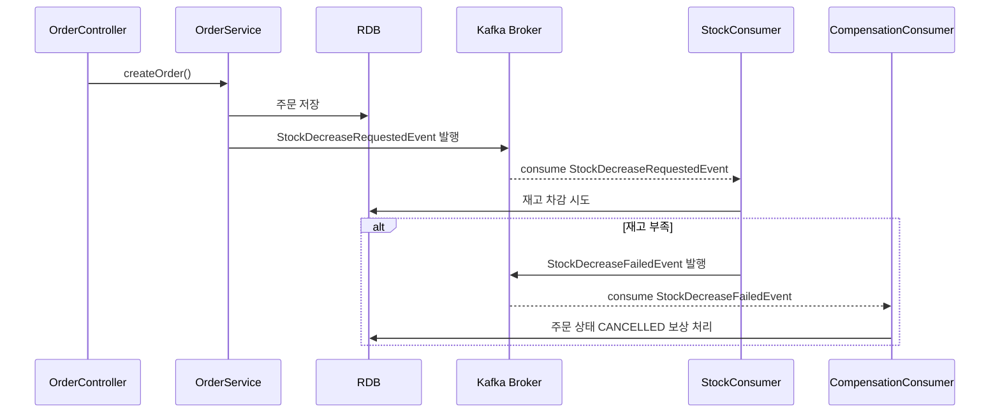
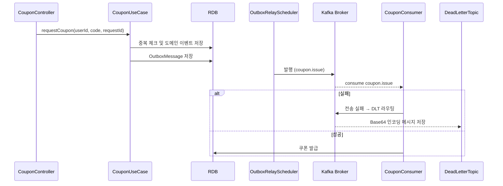

# STEP 18: Kafka를 활용한 비즈니스 프로세스 개선 보고서

## 1. 과제 목표

> 주문 처리 및 선착순 쿠폰 발급과 같은 고트래픽 비즈니스 프로세스를 Kafka 기반으로 리팩터링하여 확장성, 복원력, 메시지 안정성을 확보하는 것이 목표이다.
>

---

## 2. 기존 구조의 한계

| 항목 | 기존 방식 | 한계점 |
| --- | --- | --- |
| 주문 처리 | 동기 처리 + Redis 락 | - 사용자 피드백 지연- 재고 차감 실패 시 즉시 복구 불가- 단일 인스턴스 락 의존 |
| 쿠폰 발급 | Redis + 동기 발급 | - 재시도 어려움- 고부하 시 중복 발급 위험- 실패에 대한 보상 처리 미흡 |

---

## 3. 개선 설계: Kafka 기반 비동기 구조

### 3-1. Kafka 도입 후 설계 요약

| 항목 | 개선 방식 |
| --- | --- |
| 주문 → 재고 | 주문 완료 후 Kafka 이벤트 발행 → 소비자에서 재고 차감 |
| 실패 보상 | 재고 차감 실패 시 `stock.decrease.failed` 이벤트 발행 후 주문 취소 |
| 쿠폰 발급 | 도메인 이벤트 → Outbox → Kafka 발행 → 쿠폰 발급 |
| 실패 처리 | Consumer 예외 발생 시 DLT에 메시지 라우팅 |
| 멱등성 | 주문 ID, requestId 기준 중복 메시지 무시 처리 |

---

## 4. 시스템 시퀀스 다이어그램

### 4-1. 주문 → 재고 차감 → 보상 흐름 (Kafka)

---

### 4-2. 선착순 쿠폰 발급 (Outbox + Kafka)

---

## 5. 병렬성, 멱등성, 재처리 전략

| 전략 | 상세 내용 |
| --- | --- |
| 병렬성 | Kafka 파티션 기반 → 재고/쿠폰 소비 병렬 처리 가능 |
| 멱등성 | `requestId`, `orderId` 기준 Redis/DB 체크 후 중복 무시 |
| 재처리 | OutboxRelayScheduler 주기 실행, 실패 시 재시도 |
| 장애 대응 | DLT로 메시지 라우팅 + Base64 복호화 및 수동 처리 가능 |

---

## 6. 성능 및 신뢰성 개선 지표

| 항목 | 개선 전 | 개선 후 |
| --- | --- | --- |
| 고부하 처리 | Redis 락 기반 단일 인스턴스 병목 | Kafka 기반 병렬 소비로 확장성 확보 |
| 장애 대응 | 실패 요청은 즉시 종료 | 실패 메시지 DLT 저장 및 후속 재처리 가능 |
| 중복 처리 | 일부 중복 발급 발생 가능 | Redis/DB 기준 멱등성 완전 보장 |
| 응답 UX | 결제/재고 실패 시 즉시 오류 반환 | 주문은 먼저 완료 → 보상 처리로 UX 향상 |

---

## 7. 테스트 결과 요약

### ✅ Kafka 기반 주문 테스트 (OrderStockKafkaFlowIntegrationTest)

- 3명 동시 주문, 재고 10 → 2건 성공, 1건 실패
- 재고 0 확인
- `stock.decrease.failed` 이벤트 수신 → 주문 취소 보상 확인

### ✅ 쿠폰 발급 통합 테스트 (CouponIssueKafkaConsumerIntegrationTest)

- 중복 쿠폰 발급 요청 → Outbox 메시지 1건만 생성
- 실패 메시지 → DLT로 이동 + Base64 디코딩 확인
- 정상 메시지 → Redis/DB 발급 기록 검증

---

## 8. 결론

Kafka 기반 비동기 구조로 개선함으로써 다음과 같은 효과를 얻을 수 있었다:

- **확장성 향상**: 병렬 처리 가능한 Kafka 구조로 고부하 대응
- **신뢰성 확보**: 메시지 손실 방지를 위한 Outbox 및 DLT 전략
- **도메인 책임 분리**: 주문, 재고, 쿠폰 로직을 이벤트로 분리하여 모듈화 강화
- **테스트 가능성 향상**: EmbeddedKafka 기반 통합 테스트로 흐름 검증 용이