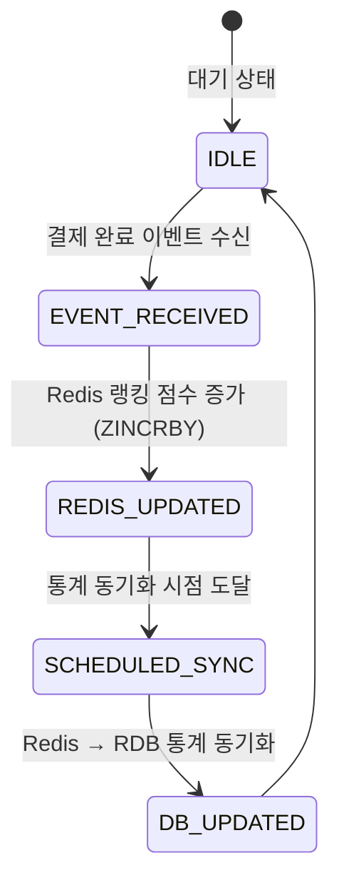
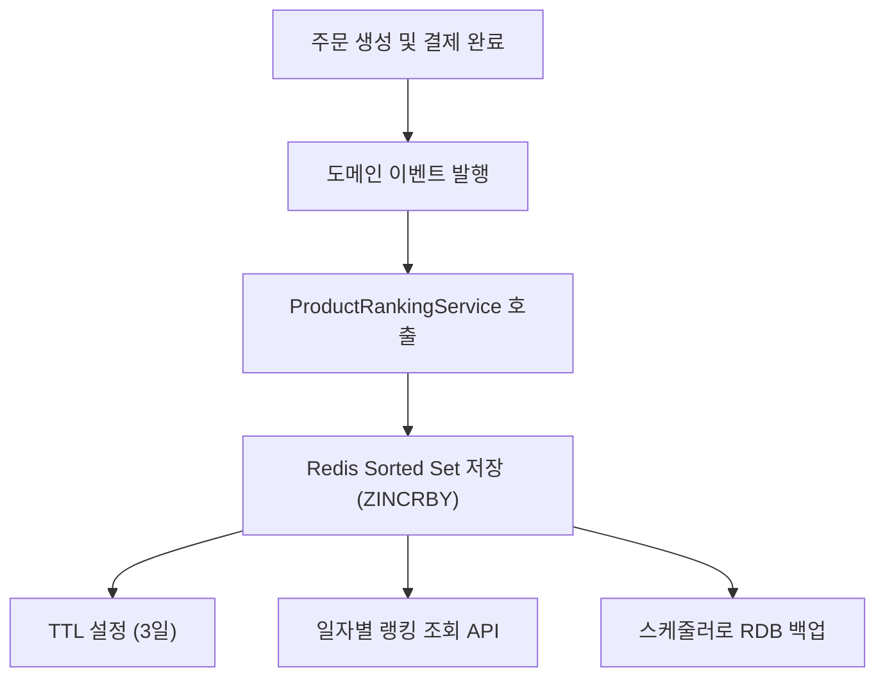

# STEP 13 - Redis 기반 인기 상품 랭킹 시스템 설계 및 구현 보고서

## 1. 🚩 배경 및 문제 정의

기존 시스템은 상품 통계를 MySQL의 `product_statistics` 테이블에 정적으로 저장하고 있었고, 실시간 인기 상품 랭킹 기능은 제공하지 않았다. 하지만 사용자에게 "현재 인기 있는 상품" 정보를 제공하거나, 마케팅 배너 등의 추천 기능에 활용하기 위해 **실시간 트래픽 기반의 랭킹 시스템**이 요구되었다.

이 기능은 단순 조회 이상의 문제로, 다음과 같은 기술적 고려가 필요했다:

- **실시간성**: 동시다발적인 주문 발생에도 빠르게 집계되어야 함
- **낮은 부하**: RDB 트랜잭션 부하를 증가시키지 않아야 함
- **기간별 통계 분리**: 일간/주간/월간 랭킹 분리가 필요
- **추후 통계 백업**: Redis 데이터는 휘발성이므로 DB 백업 필요

---

## 2. 🧱 시스템 설계

### 🔄 통계 흐름 상태 다이어그램

> 인기 상품 통계는 집계 → 캐싱 → 만료 → 재집계의 순환 구조로 운영되며,
>
>
> 이벤트 또는 스케줄러 기반으로 통계 생성 및 동기화를 수행한다.
>



---

### 🔁 핵심 흐름



---

### 🗝️ Redis Key 전략

| 분류 | 형식 | 예시 |
| --- | --- | --- |
| 일간 | `ranking:daily:{yyyyMMdd}` | `ranking:daily:20250515` |
| 주간 | `ranking:weekly:{yyyyMMdd}` | `ranking:weekly:20250512` (주차 시작일 기준) |
| 월간 | `ranking:monthly:{yyyyMMdd}` | `ranking:monthly:20250501` |

---

### 💾 Redis 자료구조

- **Sorted Set (ZSet)**
    - `ZINCRBY`로 판매 수량 누적
    - `ZREVRANGE`로 인기순 정렬
    - TTL 설정(3일)로 메모리 누수 방지 및 재집계 유도

---

## 3. ⚙️ 구현

### 1) 🎯 이벤트 기반 수집

- 결제 완료 시 `RecordProductSalesEvent` 발행
- `@TransactionalEventListener(phase = AFTER_COMMIT)`로 처리
- `ProductRankingService.record()` → 전략 패턴 기반으로 Redis 저장

```java
String key = "ranking:daily:" + LocalDate.now().format(DateTimeFormatter.ofPattern("yyyyMMdd"));
redis.incrementScore(key, productId, quantity);
```

---

### 2) 🧩 전략 패턴 분리

- `ProductRankingStrategy` 인터페이스로 전략 패턴 분리
- 구현체: `DailyRankingStrategy`, `WeeklyRankingStrategy`, `MonthlyRankingStrategy`
- `ProductRankingService`는 모든 전략 순회하며 호출

---

### 3) 🕒 일간 통계 동기화

- 매일 새벽 03:00 `ProductStatisticsSyncScheduler` 실행
- Redis → RDB(`product_statistics`)로 통계 저장
- 판매 단가는 `ProductRepository.findUnitPriceById()`에서 조회하여 도메인 결합도 낮춤

---

## 4. 🧪 테스트 및 검증

### ✅ 단위 테스트

- `ProductStatisticsServiceTest`
    - `record()`에서 전략 호출 여부 검증
    - `getTopSellingProducts()`에서 기간 기반 조회 동작 확인

### ✅ 통합 테스트

- Embedded Redis 환경 사용
- `ProductStatisticsServiceIntegrationTest`
    - 실데이터 기반 인기 상품 정렬 확인
- `ProductStatisticsSyncSchedulerIntegrationTest`
    - Redis → RDB 통계 저장 동작 검증

---

## 5. 🎯 회고

### 👍 장점

- RDB 트랜잭션 경량화 (이벤트 분리)
- 실시간 집계 가능
- 전략 패턴 도입으로 랭킹 확장성 보장
- TTL 설정으로 Redis 메모리 안정성 확보

### 👎 아쉬운 점

- Redis에 일/주/월 데이터를 모두 저장하는 것은 중복 가능성 존재
    - **On-demand aggregation**으로 개선 여지 있음
- 금액 데이터는 Redis에 없기 때문에 Redis → RDB 백업 시 DB 조회 필요
    - Redis `ZADD productId:price` 구조 도입도 고려 가능

---

## ✅ 결론

실시간 랭킹 시스템은 Redis의 ZSet을 통해 안정적으로 구현되었으며, TTL과 배치 기반의 통계 백업 구조를 조합함으로써 **성능과 신뢰성**을 모두 확보했다. 조회 API는 최근 3일간의 RDB 통계 기반으로 인기 상품을 제공하며, 캐시 미스 시에도 복원 가능한 구조를 설계했다.

또한, CQRS 및 이벤트 기반 구조를 채택함으로써 **도메인 분리**, **확장성**, **서비스 안정성**을 모두 확보한 설계였다. 단가 정보는 `Product` 도메인에서 가져오도록 개선하여 **도메인 간 의존성** 또한 낮췄다.