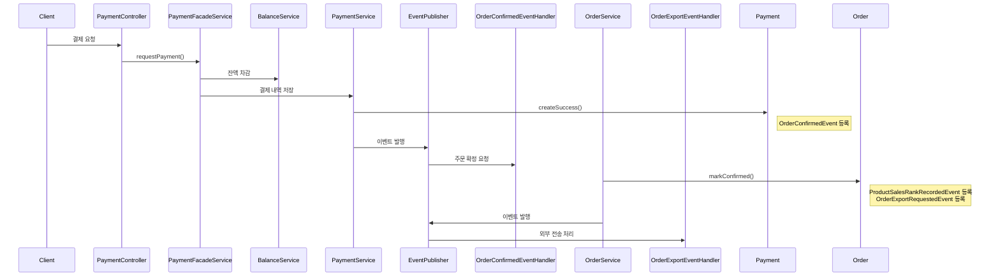

---

# 🧾 STEP 16: MSA 기반 이커머스 트랜잭션 설계 보고서

## 🏷️ 주제: 고객 중심 실시간 피드백 관점에서의 도메인 분리 및 트랜잭션 보장 전략

---

## 1. 도입: 반응성과 복원력이 요구되는 이커머스 환경

이커머스 시스템은 단순한 CRUD 처리가 아닌, 사용자의 행동에 대한 빠른 반응과 실패 대응 능력이 필수인 구조다. 고객은 다음과 같은 시점에서 **즉각적인 피드백**을 기대한다:

- “이 상품은 구매 가능한가요?” (재고)
- “결제가 완료되었나요?” (결제 결과)
- “쿠폰이 정상 적용되었나요?” (할인 적용)
- “실패했을 경우, 자동으로 복구되나요?” (장애 대응)

본 보고서는 위 요구사항을 만족시키기 위해 도메인을 분리하고, 트랜잭션을 **이벤트 기반으로 재구성**하여 실시간성과 복원력을 동시에 확보한 구조를 설계한 과정이다.

---

## 2. 도메인 분리 기준: 상태 책임 중심

기술이 아닌 **비즈니스 상태 책임**에 따라 도메인을 나누었다. 각 도메인은 오직 **자신의 상태 전이와 유효성 검증만 책임**지며, 협업은 이벤트 기반으로 연결된다.

| 서비스 | 도메인 책임 | 고객 응답 관점 |
| --- | --- | --- |
| 주문 서비스 | 주문 생성, 상태 관리 | 주문 생성 완료, 주문 상태 확인 |
| 상품 서비스 | 재고 차감, 복구 | 구매 가능 여부 |
| 결제 서비스 | 결제 처리 및 상태 기록 | 결제 성공 여부 |
| 잔액 서비스 | 잔액 차감, 충전 | 보유 금액 반영 |
| 쿠폰 서비스 | 할인 적용, 사용 기록 | 할인 여부 확인 |
| 통계 서비스 | 판매량 집계 | 비동기 후처리 |
| 외부 전송 | 데이터 연동 | 확정된 주문 데이터 전송 |

> 예: 잔액 서비스는 "잔액을 차감했다"는 사실만 이벤트로 전달하고, 결제 상태나 주문 상태에는 관여하지 않는다.
>

---

## 3. 전체 시나리오: 결제 성공 이후 흐름



---

## 4. 도메인 이벤트 정의 및 설계

### ✅ 공통 AggregateRoot

```java
public abstract class AggregateRoot<ID> {
    private final List<DomainEvent> domainEvents = new ArrayList<>();
    protected void registerEvent(DomainEvent event) { ... }
    public List<DomainEvent> getDomainEvents() { ... }
    public void clearEvents() { ... }
}
```

### 📌 도메인별 이벤트 등록 예시

| 도메인 | 메서드 | 등록된 이벤트 |
| --- | --- | --- |
| Order | markConfirmed() | ProductSalesRankRecordedEvent, OrderExportRequestedEvent |
| Payment | createSuccess() | OrderConfirmedEvent |
| Balance | charge() | RecordBalanceChargeEvent |

---

## 5. 이벤트 중심 트랜잭션 분리 전략

| 처리 단계 | 방식 |
| --- | --- |
| 핵심 로직 | `@Transactional` 내부에서 처리 |
| 부가 로직 | `@TransactionalEventListener(AFTER_COMMIT)` |
| 실패 감지 | try-catch → 로그 + 알림 |
| 복구 처리 | 보상 이벤트 발행 or 수동介입 |
| 상태 전이 실패 | `OrderConfirmationFailedEvent` 발행 |

이벤트는 Application Layer에서 수집하여 발행되며, 도메인은 단지 상태 전이와 이벤트 등록만 책임진다.

---

## 6. 분산 트랜잭션 고려 시 전략

### 🔁 도메인별 배포 및 데이터 분리 기준

각 도메인은 다음 기준에 따라 **배포 단위, 데이터 저장소, 이벤트 처리 방식**을 분리하여 운영된다. 이를 통해 도메인 간 의존도를 낮추고, 장애 전파를 차단한다.

| 도메인 | 배포 단위 | 데이터 저장소 | 이벤트 처리 |
| --- | --- | --- | --- |
| Order | 주문 서비스 | MySQL (orders) | Kafka Producer (Outbox) |
| Payment | 결제 서비스 | MySQL (payments) | Kafka Producer |
| Balance | 잔액 서비스 | MySQL + Redis | Kafka Producer |
| Statistic | 통계 서비스 | Redis → MySQL | Kafka Consumer + Scheduler |
| External Export | 외부 연동 서비스 | 없음 | Kafka Consumer (전송) |

---

### 🔐 분산 트랜잭션 보장 전략 요약

| 문제 유형 | 발생 시점 | 설계 대응 |
| --- | --- | --- |
| ✅ DB와 메시지 간 불일치 | 핵심 트랜잭션 후 Kafka 전송 실패 | Outbox Pattern→ 동일 트랜잭션 내 메시지를 DB에 저장→ 별도 Worker가 Kafka 전송 |
| ✅ 이벤트 유실 | Kafka Consumer 장애, 재시도 실패 | Kafka Retry→ 최대 시도 후 DLQ 전송→ DLQ Consumer에 의한 재처리 로직 작성 |
| ✅ 이벤트 순서 왜곡 | 동일 주문 내 이벤트의 순서 문제 | Partition Key 고정→ 동일 Aggregate ID 기준 Partition 지정→ Consumer Group 내 순차 처리 보장 |
| ✅ 보상 트랜잭션 필요 | 후속 상태 전이 실패 (e.g. 주문 확정 실패) | 보상 이벤트 발행→ ex: `OrderConfirmationFailedEvent`→ 관련 도메인에서 상태 복구 또는 알림 수행 |
| ✅ 장애 복구 / 지연 처리 | 통신 실패, 외부 API 장애 등 | 비동기 재시도 큐+ 로그 기반 복구 트레이서 설계+ Slack 등 운영 알림 연계 |
| ✅ 중복 처리 방지 | DLQ → Retry 시 재처리 | `eventId` or `requestId` 기반 **idempotency 보장 키** 적용→ DB + Redis 레벨에서 중복 처리 방지 |

---

### ☑️ 핵심 보장 원칙

- **핵심 로직은 트랜잭션 내에, 그 외는 이벤트 기반으로 처리**
- **모든 외부 이벤트 전파는 Outbox → Kafka로 이관**
- **이벤트 소비는 반드시 Consumer Group 기반으로 관리**
- **보상 시나리오는 독립된 실패 이벤트로 분리 (ex: `XXXFailedEvent`)**
- **운영 중 오류는 DLQ + 알림 시스템으로 추적 및 복구**

## 7. 결론: 이벤트 기반 설계의 실전적 가치

이번 설계는 단순히 도메인을 나누고 트랜잭션 경계를 구분하는 데서 끝나지 않는다. 핵심은 "각 도메인은 오직 자신의 관심사에만 집중해야 한다" 는 것이다.

예를 들어, 주문 도메인은 주문서를 생성하고 상태를 관리하는 것이 전부다. 상품이나 재고, 결제 수단, 잔액과 같은 정보는 필요하지만 직접 조회하거나 처리하지 않는다. 필요한 데이터(예: 결제할 금액, 상품 가격)는 외부에서 전달받고, 그 정보를 기준으로 **주문 상태만** 전이시킨다.

잔액 도메인 역시 마찬가지다. 스스로 잔액을 차감하고, 성공 여부만 이벤트로 알릴 뿐이다. 결제나 주문에 관심이 없다. 이처럼 각 도메인은 자신의 상태 전이와 유효성 검증만 책임지고, **그 외 협업은 이벤트로 구성한다.**

이러한 구조는 다음과 같은 실질적 장점을 갖는다:

- **실시간 반응 우선**

  고객 요청에 대해 빠르게 응답하고, 부가 처리는 이후 이벤트로 이어간다. UX 관점에서 지연 없는 상호작용을 제공할 수 있다.

- **상태 기반 설계**

  도메인의 모든 로직은 상태 전이 중심으로 구성되어 있다. CREATED → CONFIRMED → CANCELLED 같은 흐름은 UX와 시스템 모두에게 명확한 피드백을 제공한다.

- **도메인 간 약결합**

  직접 호출 없이 이벤트로 연결되므로 서비스 간 의존도가 낮고, 변경에 강하며 테스트가 쉬워진다.

- **장애에 강한 구조**